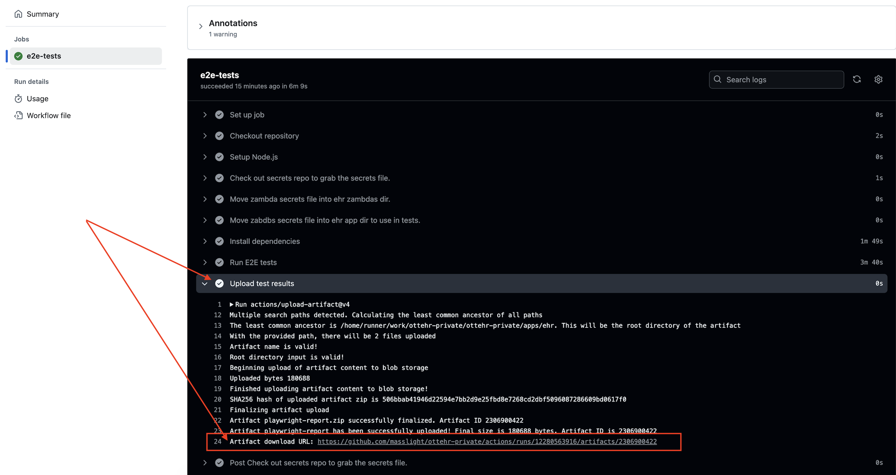

# EHR E2E Documentation

This guide covers our E2E testing approach using Playwright in a Turborepo monorepo setup.

The implementation supports both local development and CI/CD pipelines, with features for resource management, authentication, and parallel test execution.

## Running Tests

Tests are primarily managed from the root directory during local development. From here, you can run local tests in regular or UI mode for debugging, as well as run tests for a selected environment.

| Environment      | Command                    | Description               |
| :--------------- | :------------------------- | :------------------------ |
| Local Headless   | `npm run ehr:e2e:local`    | Run tests without UI      |
| Local Debug      | `npm run ehr:e2e:local:ui` | Run with UI for debugging |
| Demo Environment | `npm run ehr:e2e:demo`     | Run in demo environment   |

**Auto login:**\
When tests run on CI or if you run tests by command from the root package (i.e., by `npm run ehr:e2e:local:ui`), it will run `apps/ehr/test/e2e/login/login.spec.ts` before all other tests. That login test resets the current Playwright context, opens the login page, and types the username and password from the current environment file `apps/ehr/.env/tests.local.json`. It will then use the credentials from this session in all subsequent tests.

**Manual login**:\
From the `./apps/ehr directory`, you can perform `npm run e2e:manual-login` command if you need to log in with your own account for testing. In this case, the script `./apps/ehr/auth.setup.js` will be executed, which resets the Playwright context and opens the authorization page where you can log in. After logging in, you can run .spec tests, and they will use the authentication from this session.

### CI/CD Integration

On the CI tests run automatically on pull requests to `main` and `develop` branches via _GitHub Actions_.

The test pipeline captures detailed artifacts for failed tests. These artifacts (screenshots, traces, videos, and reports) are accessible through GitHub Actions UI.

Artifacts can be downloaded from the **_Upload test results_** step by navigating to _job details_ from the pull request.



You can also download artifacts by going to the _Actions page_, selecting _EHR E2E Tests_ in the left menu, and clicking the download icon at the bottom right of the page.


**The video report** is located in the `test-results` directory in the downloaded archive. Below is some information about the reports used and links to their more detailed description.

| Reporter Type  | Description                                                                                                                                                            | Documentation                                                                    |
| :------------- | :--------------------------------------------------------------------------------------------------------------------------------------------------------------------- | :------------------------------------------------------------------------------- |
| HTML Reporter  | The HTML reporter provides a detailed interactive test report with full test execution details. This is the default reporter that generates a user-friendly interface. | [HTML Reporter Docs](https://playwright.dev/docs/test-reporters#html-reporter)   |
| List Reporter  | The list reporter outputs test results directly in the console in a simple list format, making it easy to quickly scan results during local test execution.            | [List Reporter Docs](https://playwright.dev/docs/test-reporters#list-reporter)   |
| JUnit Reporter | The JUnit reporter generates test results in XML format compatible with CI/CD systems. Results are saved to.                                                           | [JUnit Reporter Docs](https://playwright.dev/docs/test-reporters#junit-reporter) |

## Test-Related Files Overview

We utilize the following structure to run and configure E2E tests:

```
.
├── test/
│   └── e2e/
│       ├── specs/                    # EHR E2E tests
│       ├── login/                    # technical login test
│       └── e2e-utils/                # utils
│
├── src/
│   └── constants/
│       └── data-test-ids.ts          # Data-test id selectors
├── packages/
│   └── ehr/
│       └── zambdas/
│           └── .env/                 # Zambda secrets
├── apps/
│   └── ehr/
│       └── env/                      # Secrets by template: tests.*.json
├── package.json                      # base scripts for running tests
├── turbo.json                        # Monorepo pipeline configuration
├── vite.config.ts                    # Build settings
└── .github/
   └── workflows/
       └── e2e-ehr.yml                # CI pipeline for E2E tests
```

| File                                      | Purpose                                                                                                                             |
| :---------------------------------------- | :---------------------------------------------------------------------------------------------------------------------------------- |
| `apps/ehr/test/e2e/specs/*.spec.ts`       | Test scenarios.                                                                                                                     |
| `apps/ehr/test/e2e/e2e-utils/*.ts`        | Helper utilities for test execution, including the ResourceHandler for FHIR resource management and authentication utilities.       |
| `apps/ehr/src/constants/data-test-ids.ts` | Centralized repository of data-test id selectors to maintain consistent element identification across tests.                        |
| `.github/workflows/e2e-ehr.yml`           | CI/CD pipeline definition for E2E tests. Configures test execution on PR events, manages secrets, and handles artifact collection.  |
| `packages/ehr/zambdas/.env/*`             | Environment configuration for backend Zambda functions. Contains API endpoints, credentials, and other runtime settings.            |
| `apps/ehr/env/*`                          | Environment variables for the UI application and test execution. Includes test credentials and environment-specific configurations. |
| `package.json`                            | Root-level npm scripts for test execution. Defines commands for local testing, CI runs, and debugging sessions.                     |
| `apps/ehr/package.json`                   | EHR-specific scripts including manual login utilities and environment-specific test runners.                                        |
| `turbo.json`                              | Monorepo pipeline configuration defining test execution order, caching rules, and dependencies between packages.                    |
| `vite.config.ts`                          | Application build configuration including environment variable handling, server settings, and build optimizations.                  |
| `apps/ehr/playwright.config.ts`           | Playwright configuration including browser settings, timeouts, parallelization, and reporter configurations.                        |
| `test/e2e/login/*.spec.ts`                | Automated login test implementation that handles authentication state setup for subsequent tests.                                   |

#### Framework Configuration

The E2E testing setup is primarily configured through `apps/ehr/playwright.config.ts`. This configuration file defines the testing environment parameters using the Playwright `defineConfig` function. The base configuration specifies the test directory and sets up parallel execution mode with conditional settings based on whether tests are running in CI or development environments.

Test reporting is configured to output in multiple formats simultaneously through an array of reporters, combining HTML, list, and JUnit outputs.

#### Environment Management

**QUICK START**: Delete the `env` directories and run any local e2e test to automatically create them with required secrets:

```Shell
# Remove existing env directories
rm -rf packages/ehr/zambdas/.env
rm -rf apps/ehr/env

# Run any local e2e test to automatically create env directories and copy secrets
# For example:
npm run ehr:e2e:local:ui

# The script will:
# 1. Create packages/ehr/zambdas/.env directory and copy required secrets
# 2. Create apps/ehr/env directory and copy required secrets
# 3. Run the tests

# Note: If env directories already contain files, they won't be overwritten.
# In this case, you'll need to configure environment variables manually.
```

Environment variables control the test behavior through conditional configuration. The system determines whether it's running in CI by checking `process.env.CI`, which affects settings like retry attempts, screenshot capture, and video recording.

The base URL for tests is configured through `process.env.WEBSITE_URL`, which enables Playwright tests to run against both localhost and remote environments.

The most reliable way to learn about actual environment variables is to check the GitHub Actions configuration in `.github/workflows/e2e-ehr.yml`. You'll find steps like:

```YAML
- name: Move zambda secrets file into ehr zambdas dir.
  run: mkdir -p packages/ehr/zambdas/.env; cp secrets/zambdas/* packages/ehr/zambdas/.env

- name: Move tests secrets file into ehr app dir to use in tests.
  run: mkdir -p apps/ehr/env && cp secrets/ehr/app/tests.*.json apps/ehr/env/
```

For test execution, you need to copy the specified environment variables into these directories. For running tests against a remote environment, you may need an additional configuration file. Check if it exists in the <https://github.com/masslight/ottehr-secrets> repository.

Note that for creating resources in EHR, you need to copy the `secrets/ehr/app/tests.local.json` file to the `apps/ehr/env` directory.

---

Description of how environment variables from the secrets repository are used in the EHR repository tests:

| Path in ottehr-secrets          | Path in EHR repo                                           | Purpose                                                                                                | Usage in tests                                       |
| :------------------------------ | :--------------------------------------------------------- | :----------------------------------------------------------------------------------------------------- | :--------------------------------------------------- |
| ehr/app/.env.local              | taken from apps/ehr/env/.env.local, loaded via vite.config | local build                                                                                            | local run, CI                                        |
| zambdas/local.json              | packages/ehr/zambdas/.env/local.json, loaded via env-cmd   | local build                                                                                            | local run, CI                                        |
| ehr/app/test.{local\|demo}.json | apps/ehr/env/test.\*.json, loaded via env-cmd              | for configuring tests (frontend URL, FHIR API, authorization for resource creation, web authorization) | **local**: local run, CI, **demo**: demo environment |

**Note**:\
_local run_ - running E2E tests locally, when backend and frontend are running locally\
_CI_ - running E2E tests on CI, when backend and frontend are running on CI\
_demo environment_ - running tests locally, using frontend and backend of remote environment

#### Test Execution Process

Test execution is managed through the `/scripts/run-e2e.js` script, which handles the complete test lifecycle. The script first checks and clears any processes running on the required ports (4001 and 4002) to prevent conflicts. For local development, it spawns the application and uses `wait-on` to ensure the application is fully started before beginning tests.

The script supports different execution modes through environment variables and command line arguments. The `ENV` variable determines the target environment, while the `--ui` flag toggles between headless and UI modes. Test execution is performed using Turbo, which manages the build pipeline and dependencies.

#### Build Pipeline Integration

Turbo handles the build pipeline configuration through `turbo.json`. E2E tests are integrated into the pipeline with specific dependencies on build tasks. The pipeline configuration ensures tests only run after successful builds and linting, with different configurations for various deployment environments.

#### Using DataTest-ID

It's good practice to avoid hardcoding data test IDs. We use a constants file for this purpose at `apps/ehr/src/constants/data-test-ids.ts`:

```TypeScript
export const dataTestIds = {
  header: {
    userName: 'header-user-name',
  },
  dashboard: {
    addPatientButton: 'add-patient-button',
    tableRowWrapper: (appointmentId: string) =>
      `appointments-table-row-${appointmentId}`
  }
};
```

As you can see, some values are strings and some are functions. The data test ID should be unique per page, so use functions to generate unique values. If you can't use a persistent ID value to generate a data test ID, it's a good idea to use React's `useId` hook.

It is recommended not to create deep nesting in the description of data test attributes. Since the application structure may change over time, the structure in this configuration may no longer correspond to it. A flat structure is more universal in this regard.

#### E2E-Utils; Resource Management

Sometimes tests need to have predefined resources. The `ResourceHandler` utility class is currently used for this purpose. In parallel tests, it creates unique FHIR resources per test process, because parallel tests can't share resources with each other.

`ResourceHandler` is just a helper class for managing FHIR resources. You may write your own implementations based on this example or update the current solution. An important consideration is that handling FHIR API calls inside parallel tests means duplicate API calls - each worker inside Playwright hooks like `test.beforeAll` creates its own FHIR resources.

```TypeScript
// each parallel process does this, test.beforeAll is not shared
const resourceHandler = new ResourceHandler();
await resourceHandler.setResources();     // Multiple API calls per worker
await resourceHandler.cleanupResources(); // Clean up after tests per worker
```

For shared resources, you have two options:

1. Run tests sequentially `workers: 1` in config
2. Implement setup/cleanup scripts and update the test command:

```Shell
# Future optimization if needed
npm run setup-test-resources && npm run e2e:specs && npm run cleanup-test-resources
```

## Testing with Playwright

Playwright has extensive and well-written documentation available on [their website](https://playwright.dev/). Below are some examples to get you started with this framework.

Important considerations:

- Store datatest-id constants in a centralized location `data-test-ids.ts`
- Apply functions for generating dynamic IDs
- Maintain as flat naming structure as possible

## Tests naming

Use descriptive filenames and test names that explain purpose and behavior. This approach makes tests self-documenting and easier to maintain. You can add reference IDs as a comment if needed for traceability.

```TypeScript
// 🔴 Less helpful:
// File: TC1and2and3.spec.ts
test.describe('TC1,2', () => {
  test('TEST_001', ...)
  test('TEST_002', ...)
})

// ✅ Recommended:
// File: doctor-appointments.spec.ts
test.describe('Appointment Scheduling', () => {
 // [TC-1]
 test('patient should book available time slot with doctor', ...)
 // [TC-2]
 test('should display confirmation after successful booking', ...)
})
```

##### Basic Test Structure

```TypeScript
import { test, expect, Page } from '@playwright/test';

test('test description', async ({ page }) => {
  await page.goto('/some-url');
  await expect(page.getByTestId('element-id')).toBeVisible();
});
```

##### Working with Hooks

```TypeScript
test.describe('Group of tests', () => {
  let resourceHandler: ResourceHandler;

  test.beforeAll(async () => {
    resourceHandler = new ResourceHandler();
    await resourceHandler.setResources();
  });

  test.afterAll(async () => {
    await resourceHandler.cleanupResources();
  });

  test.beforeEach(async ({ page }) => {
    await page.waitForTimeout(2000); // Wait for resources to be ready
  });
});
```

##### Selectors and data-test-id

```TypeScript
// constants/data-test-ids.ts
export const dataTestIds = {
  dashboard: {
    addPatientButton: 'add-patient-button',
    intakeButton: (id: string) => `intake-button-${id}`,
    tableRow: (id: string) => `table-row-${id}`
  }
};

// Usage in tests
test('find elements by test id', async ({ page }) => {
  // Basic search
  await page.getByTestId(dataTestIds.dashboard.addPatientButton).click();

  // With dynamic id
  await page.getByTestId(dataTestIds.dashboard.tableRow(appointmentId)).isVisible();
});
```

##### Assertions

```TypeScript
test('assertions examples', async ({ page }) => {
  // Visibility check
  await expect(page.getByTestId('element')).toBeVisible();

  // Text content check
  await expect(page.getByTestId('header')).toContainText('Expected text');

  // Value check
  await expect(page.getByTestId('input')).toHaveValue('expected value');

  // URL check
  await expect(page).toHaveURL('/expected-path');
});
```

##### Form Handling

```TypeScript
test('form interaction', async ({ page }) => {
  // Fill input field
  await page.getByTestId('input-field').fill('test value');

  // Select from dropdown
  await page.getByTestId('select').click();
  await page.getByText('Option 1').click();

  // Submit form
  await page.getByTestId('submit-button').click();
});
```

##### Waiting for States

```TypeScript
test('wait for states', async ({ page }) => {
  // Wait for element to appear
  await page.getByTestId('loader').waitFor({ state: 'visible' });

  // Custom wait function, useful when tested element have initial value
  await expect(async () => {
    const content = await page.getByTestId('content').textContent();
    return content?.includes('expected text') ?? false;
  }).toPass({ timeout: 30000 });
});
```

##### React Components with data-test-id

```TypeScript
// Button component
const Button = ({ testId, children, ...props }) => (
  <button
    data-testid={testId}
    {...props}
  >
    {children}
  </button>
);

// IconButton component
const IconButton = ({ testId, appointmentId, ...props }) => (
  <button
    data-testid={dataTestIds.dashboard.intakeButton(appointmentId)}
    onClick={(e) => {
      e.preventDefault();
      e.stopPropagation();
      // logic
    }}
    {...props}
  />
);
```

##### Navigation

```TypeScript
test('navigation examples', async ({ page }) => {
  // Direct navigation
  await page.goto('/dashboard');

  // Click navigation
  await page.getByTestId('nav-link').click();

  // Check URL after navigation
  await page.waitForURL('/new-page');
});
```

##### Table Interactions

```TypeScript
test('table interactions', async ({ page }) => {
  const row = page.getByTestId(dataTestIds.dashboard.tableRowWrapper(res.appointmentId));

  // Check cell content
  await expect(row.getByTestId('cell-name')).toContainText(res.personName);

  // Click on row
  await row.click();
});
```

## Troubleshooting

Chromium failed with signal 11 (SEGV_ACCERR):

```
npm install -D @playwright/test@latest
npx playwright install
```

---

How to Debug Tests on a Local Machine:

1. Insert `await page.pause()` into the test you want to debug
2. Add the `--debug` option to the package script:
   ```JSON
   "e2e:specs:ui": "node setup-test-deps && npm run e2e-skeleton ./test/e2e/specs -- --ui --debug"
   ```
3. The test will open in a separate browser window and pause at the specified point, allowing you to inspect the current state
4. Remember to resume the test afterward; otherwise, the cleanup resource hook won't execute
