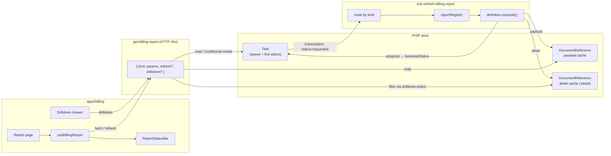
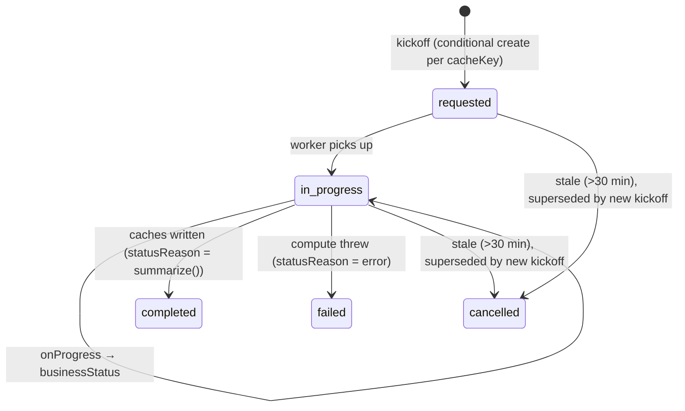
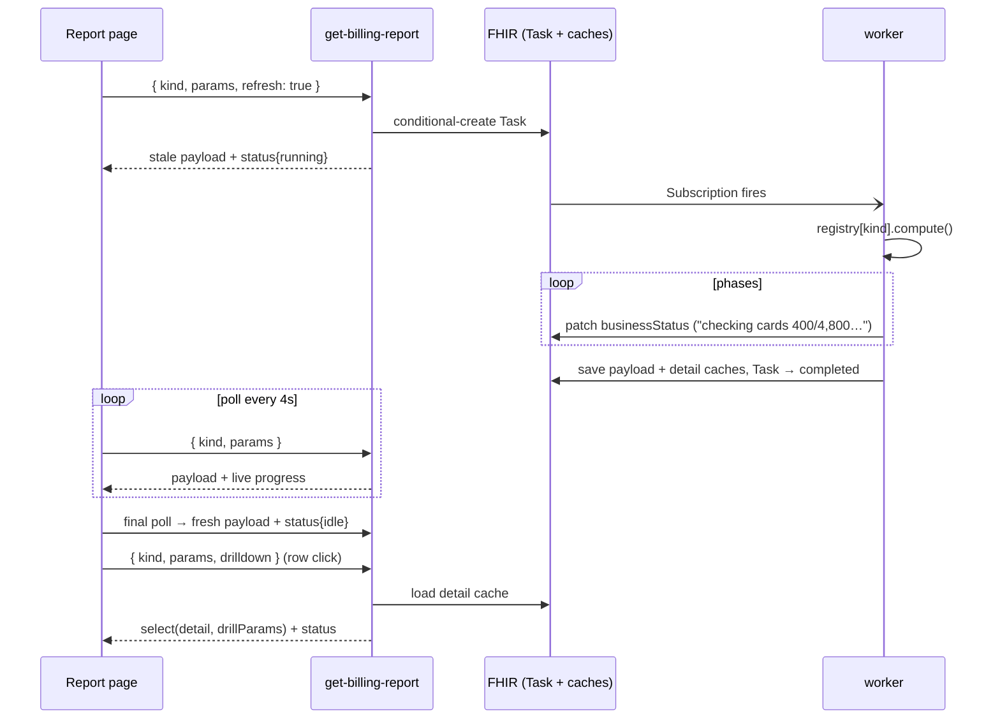

# Billing Report Refresh Framework

How the billing app's reports are computed, cached, refreshed, and drilled into. This document
describes the **mechanism**; the individual reports built on it are documented in
[billing-reports.md](./billing-reports.md).

## 1. The model in one paragraph

Every billing report follows the same task/subscribe pipeline: the HTTP zambda **never
computes** — it serves a cached snapshot plus a refresh status, and queues an async refresh as
a FHIR `Task`. A Subscription fires a worker zambda that routes the Task to the report's
definition, runs its `compute()` with a long timeout, streams progress back onto the Task, and
writes the result (and optionally a drilldown dataset) to gzip caches. The frontend polls the
cheap HTTP endpoint while a refresh runs and renders one uniform status bar everywhere.

There are exactly **two zambdas** for all reports:

| Zambda | Role |
|---|---|
| `get-billing-report` | serve cache + status; queue refreshes; serve drilldown slices |
| `sub-refresh-billing-report` | compute; write caches; report progress (Task-subscription worker) |

Adding a new report kind means writing one `ReportDefinition` and registering it — no new
zambdas, no new config, no new frontend plumbing beyond a typed api wrapper and a page.

## 2. Architecture



Two invariants:

1. The **Task is the single source of truth for refresh state**; the cache documents are the
   single source of truth for report data.
2. The HTTP zambda only ever reads/writes those resources — filtering a cached detail dataset
   is the heaviest thing it does.

## 3. Code layout

```
packages/zambdas/src/billing/reports/
├── framework/
│   ├── types.ts          # ReportDefinition contract, ReportContext, ReportPayload
│   ├── registry.ts       # reportRegistry: RefreshReportKind → definition
│   ├── refresh-task.ts   # Task queue: kickoff (race-free), find active/failed, progress writer
│   └── report-cache.ts   # gzip DocumentReference load/save, cache keys, detail envelope
├── definitions/
│   └── *.report.ts       # one self-contained ReportDefinition per kind (see billing-reports.md)
├── get-billing-report/   # the HTTP zambda
└── shared.ts             # ERA/date helpers shared by report computes

packages/zambdas/src/subscriptions/task/sub-refresh-billing-report/   # the worker

apps/billing/src/
├── hooks/useBillingReport.ts        # fetch + poll-while-running loop
├── components/ReportStatusBar.tsx   # idle / running / error header widget
└── api/api.ts                       # typed per-kind wrappers over get-billing-report

packages/utils/lib/types/data/billing/
├── billing.constants.ts  # REFRESH_REPORT_KINDS, Task codes
├── billing.schemas.ts    # GetBillingReportInputSchema, per-kind params schemas
└── billing.types.ts      # payload/detail/response types, ReportRefreshStatus
```

## 4. The `ReportDefinition` contract

Defined in [framework/types.ts](../packages/zambdas/src/billing/reports/framework/types.ts):

```ts
interface ReportDefinition<Params, Payload extends ReportPayload, Detail, DrillParams> {
  kind: RefreshReportKind;          // 'payments' | 'invoice' | …
  cacheVersion: string;             // bump to invalidate stale-shape caches
  paramsSchema: ZodType<Params>;    // validates HTTP input AND Task input
  cacheKeyOf: (params) => string;   // params part of the cache key ('' if unparameterized)
  emptyPayload: () => Payload;      // served while the first refresh runs

  // full recomputation, worker-side; detail is the optional drilldown dataset
  compute: (ctx, params, onProgress) => Promise<{ payload: Payload; detail?: Detail }>;

  savesOwnCache?: boolean;          // compute persists intermediate state itself (worker skips save)
  sanitizePayload?: (p) => Payload; // strip internal state before a payload leaves the server
  shrink?: (p) => Payload | undefined;        // shed data until an oversized payload fits
  shrinkDetail?: (d) => Detail | undefined;   // same, for the detail dataset
  detailCacheKeyOf?: (params) => string;      // when detail keys differently than the report

  drilldown?: {
    paramsSchema: ZodType<DrillParams>;
    select: (detail, drillParams) => Record<string, unknown>;  // pure filter, HTTP-side
    empty: () => Record<string, unknown>;                      // served before first compute
  };

  summarize: (payload) => string;   // one-liner for the Task's completion statusReason
}
```

`ReportContext` gives compute a billing-tagged client (`oystehr`), an untagged client for
clinical resources (`untaggedClient`), and `secrets` for external systems (Stripe, etc.).

## 5. Request/response protocol

`POST get-billing-report` with `{ kind, params?, refresh?, drilldown? }`
([GetBillingReportInputSchema](../packages/utils/lib/types/data/billing/billing.schemas.ts)):

- **Fetch** (`{ kind, params }`): serve the cached payload (sanitized) + `status`. If the
  report has never been computed, queue the first refresh and serve `emptyPayload()`.
- **Refresh** (`refresh: true`): queue a refresh (idempotent, §6) and fall through to fetch.
- **Drilldown** (`drilldown: {…}`): validate against the definition's drilldown schema, load
  the detail cache, return `drilldown.select(detail, drillParams)` + `status`. Empty result
  until the first refresh has written the detail document.

Every response carries the uniform envelope:

```ts
interface ReportRefreshStatus {
  state: 'idle' | 'running' | 'error';
  lastCompletedAt?: string;  // ISO of the served snapshot
  progress?: string;         // live worker phase text while running
  error?: string;            // most recent failure's statusReason
  cacheSizeBytes?: number;   // stored (gzip) size of the served cache document
  truncated?: boolean;       // the served payload was cut down to fit cache limits
}
// response = { ...payloadOrSlice, generatedAt, fromCache, status }
```

Error state is derived server-side: a `failed` refresh Task **newer than the served cache**
means "your data is fine, the last attempt broke".

## 6. The refresh Task

Created by `kickOffRefreshTask` in
[framework/refresh-task.ts](../packages/zambdas/src/billing/reports/framework/refresh-task.ts):

- `code`: `EXPORT_TASK_SYSTEM|refresh-billing-report` — the Subscription in
  [config/billing-app-core/zambdas.json](../config/billing-app-core/zambdas.json) matches this
  with `status=requested`.
- `identifier`: `ottehrIdentifierSystem('billing-report-refresh')|<cacheKey>` — the searchable
  dedupe key.
- `input[]`: report kind, JSON-serialized params (re-validated by the worker), and cacheKey.
- `businessStatus.text`: live progress phrase, patched by the worker via `onProgress`.

**Race-free idempotency.** Creation is a FHIR conditional create
(`fhir.create(task, { ifNoneExist: identifier + status=requested,in-progress })`), so
concurrent kickoffs — React StrictMode double-mounts, two users, parallel tabs — atomically
resolve to one Task server-side. Stale tasks (untouched > 30 min, assumed hard-killed worker)
are patched to `cancelled` before a replacement is created, so they can never wedge the
condition.



## 7. Caching

All caches are **gzipped JSON in a `DocumentReference` attachment**, identified by
`ottehrIdentifierSystem('billing-report')|<key>` and upserted by
[framework/report-cache.ts](../packages/zambdas/src/billing/reports/framework/report-cache.ts):

| Document | Key | Contents |
|---|---|---|
| payload cache | `<kind>:<cacheVersion>:<paramsKey>` | the report response payload (rows, totals, …) |
| detail cache | `<kind>:<cacheVersion>:<detailParamsKey>:detail` | `{ generatedAt, detail }` drilldown dataset |

- Parameterized reports get one payload document per params combination (e.g. per date window).
- A 4 MB cap keeps documents under FHIR resource limits; oversized saves run through the
  definition's `shrink`/`shrinkDetail` until they fit, or are skipped with a warning. A shrink
  iteration that doesn't reduce the encoded size aborts the save (no-progress guard). A failed
  cache write never fails the refresh.
- Definitions that drop data set `truncated` on the payload; it surfaces as `status.truncated`.
- `cacheVersion` bumps orphan old documents rather than migrating them.

## 8. The worker

[sub-refresh-billing-report](../packages/zambdas/src/subscriptions/task/sub-refresh-billing-report/index.ts)
is a pure dispatcher: validate the Task inputs → look up the definition → `compute()` with an
`onProgress` that patches `Task.businessStatus` → save payload (unless `savesOwnCache`) → save
detail (when present) → complete the Task with `summarize()` as the statusReason. A thrown
compute marks the Task `failed` with the error message, which the HTTP zambda surfaces as
`status.state: 'error'`.



Progress reporting conventions: each `onProgress` call is a FHIR patch, so computes throttle
streaming counts (e.g. every 250–1,000 items). Totals are only shown when known up front
("checking cards 400/4,800…"); cursor-paginated listings show running counts
("listing customers… 12,000 so far").

## 9. Frontend

- [useBillingReport](../apps/billing/src/hooks/useBillingReport.ts): initial load, refetch on
  params change (generation-counter guarded against races/unmount), `refresh()` action, and a
  ~4 s polling loop while `status.state === 'running'`.
- [ReportStatusBar](../apps/billing/src/components/ReportStatusBar.tsx): one widget for every
  report header — de-emphasized "Updated 12 minutes ago · 1.2 MB" when idle (absolute time in
  tooltip), phase text over a slim indeterminate bar when running, warning + Retry on error,
  plus an amber "Truncated" chip whenever the served payload was cut down.
  `mergeReportStatuses` collapses several statuses (running > error > oldest idle) for pages
  hosting more than one kind.
- [api.ts](../apps/billing/src/api/api.ts) keeps compile-time payload types via thin per-kind
  wrappers that all call the same endpoint.

## 10. Adding a new report

1. Add the kind to `REFRESH_REPORT_KINDS` in
   [billing.constants.ts](../packages/utils/lib/types/data/billing/billing.constants.ts).
2. Define payload (and detail/drilldown, if any) types in `billing.types.ts`; pick or add a
   params schema in `billing.schemas.ts`.
3. Write `definitions/<kind>.report.ts` with `compute()` and register it in
   [framework/registry.ts](../packages/zambdas/src/billing/reports/framework/registry.ts).
4. Add a typed wrapper in `api.ts`, and a page using `useBillingReport` + `ReportStatusBar`.

No zambda, config, or role changes.

## 11. Design decisions & tradeoffs (recorded)

- **Snapshot drilldowns.** Drilldowns are filtered views of the same snapshot the report was
  built from — internally consistent with the rows the user clicked, at the cost of freshness
  (e.g. patient-payment Stripe statuses are as-of-refresh, labeled "as of <time>" in the UI).
- **Single grant RBAC.** Access is per-zambda in Oystehr; one `get-billing-report` grant covers
  all kinds. Kind-level checks (via `callerHasRole`) are the escape hatch if ever needed.
- **One worker profile.** All computes share one timeout/memory/bundle. If a report ever needs
  a different profile, give its Task a distinct code and register a second worker over a
  registry partition — the framework doesn't change.
- **Polling, not push.** 4 s polling of a cheap cache read; SSE/websockets deliberately out of
  scope.
