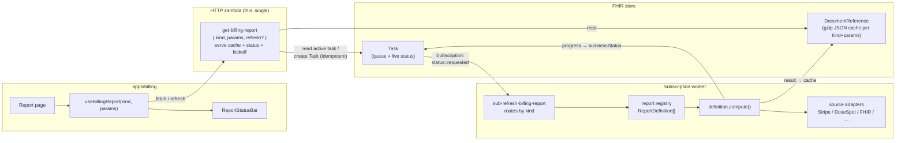
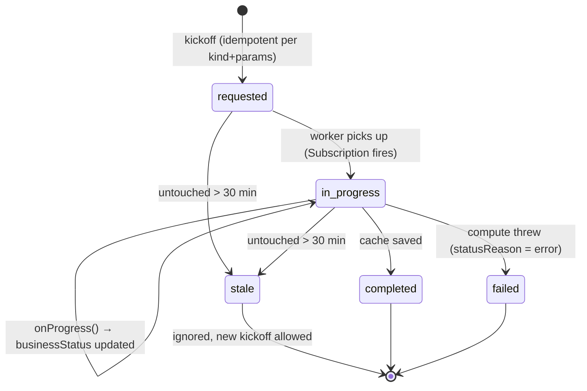
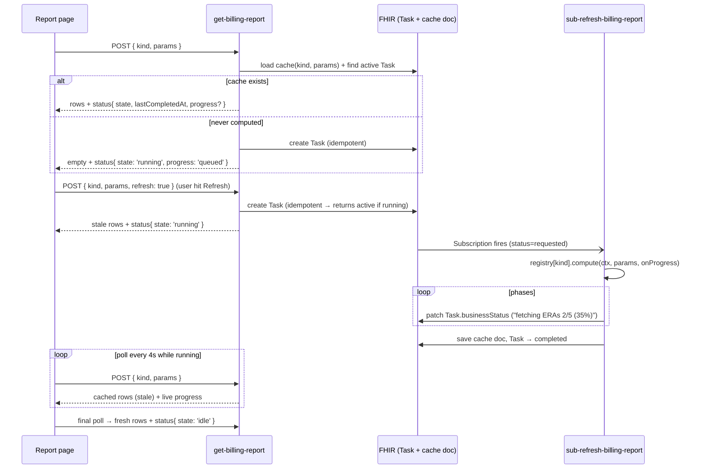

# Billing Report Refresh Framework — Design Proposal

Status: **draft for discussion** (rev 2 — consolidated to a single HTTP zambda, added
source-adapter layer and worker-split escape hatch)

## 1. Problem

Today the seven billing reports use three different execution models, two different cache
resources, and four slightly different copies of the same page-level refresh UX:

| Report | Execution today | Cache resource | Refresh UX today |
|---|---|---|---|
| Invoice | task/subscribe (async worker) | `DocumentReference` (gzip JSON) | chip + poll loop |
| Cards on file | task/subscribe (async worker) | `DocumentReference` (gzip JSON) | chip + poll loop |
| Payments | direct (inline compute) | `MeasureReport` | chip, no live progress |
| Patient payments | direct (inline compute) | `MeasureReport` | piggybacks on Payments page |
| Pipeline | direct (always recomputes) | `DocumentReference` (history snapshots only) | chip, no live progress |
| Payments drilldown | direct | none | none |
| Productivity | direct | none | none |

Problems this causes:

- **Timeout risk.** Direct reports compute inside the HTTP request; as data grows they will
  hit the zambda timeout (the invoice/cards-on-file reports already had to migrate for this
  reason).
- **Duplication.** `kickOffRefreshTask` / `findActiveRefreshTask` / cache load-save /
  poll-until-done logic is re-implemented per report with small variations.
- **Inconsistent UX.** Some pages show live progress, some show a static chip, some show
  nothing. The "Refreshing…" state is rendered differently everywhere.

## 2. Goals

1. **Every report** runs through the same task/subscribe pipeline: HTTP zambdas *never*
   compute, they only serve cache + queue refreshes.
2. **One backend framework**: a report is described by a small `ReportDefinition` object;
   the framework provides the task queue, the worker routing, the cache store, and the
   progress writer.
3. **One frontend framework**: a `useBillingReport` hook + a `ReportStatusBar` component
   shared by all report pages:
   - idle → de-emphasized (greyed-out) "Last updated …" line
   - running → animated progress indicator with the live phase text, periodically updated
   - error → surfaced inline with a retry affordance
4. Adding report #8 means writing one `compute` function, one definition entry, and one
   page that uses the shared hook — nothing else.

## 3. Architecture Overview



Key idea: the **Task resource is the single source of truth for refresh state**, and the
**cache document is the single source of truth for report data**. The frontend only ever
polls one cheap HTTP zambda; that zambda only ever reads/writes those two resources and
never computes.

**Two zambdas total**: `get-billing-report` (HTTP, fetch + kickoff) and
`sub-refresh-billing-report` (worker). Per-report code reduces to a
`definitions/*.report.ts` file.

## 4. Backend Framework

New directory: `packages/zambdas/src/billing/reports/framework/`

### 4.1 `ReportDefinition` — the per-report contract

```ts
// packages/zambdas/src/billing/reports/framework/types.ts
export interface ReportDefinition<Params, Result> {
  kind: ReportKind;                       // 'payments' | 'invoice' | ... (utils constant)
  cacheVersion: string;                   // 'v1' — bump to invalidate stale-shape caches
  paramsSchema: ZodSchema<Params>;        // validates both HTTP input and Task input
  cacheKeyOf: (params: Params) => string; // e.g. `${dateFrom}:${dateTo}`; '' if unparameterized
  cacheTtlMinutes?: number;               // optional: auto-requeue refresh when cache is older
  compute: (ctx: ReportContext, params: Params, onProgress: ProgressFn) => Promise<Result>;
}

export type ProgressFn = (message: string, percent?: number) => Promise<void>;

export interface ReportContext {
  oystehr: Oystehr;          // billing-tagged client
  untaggedClient: Oystehr;   // clinical resources (patients/appointments)
  secrets: Secrets;
  sources: ReportSources;    // lazy adapters for external systems (§4.2)
}
```

All seven reports become `ReportDefinition` instances registered in one place:

```
packages/zambdas/src/billing/reports/
├── framework/
│   ├── types.ts                  # ReportDefinition, ReportContext, status types
│   ├── registry.ts               # definitions map: kind → ReportDefinition
│   ├── refresh-task.ts           # kickOff / findActive / progress writer (generalized from today's)
│   ├── report-cache.ts           # generic gzip DocumentReference load/save, keyed by kind+version+params
│   └── sources/                  # external-system adapters shared by all computes (§4.2)
│       ├── stripe.source.ts
│       ├── dosespot.source.ts    # (when a report needs it)
│       └── fhir.source.ts
├── definitions/
│   ├── payments.report.ts        # compute() extracted from today's get-billing-payments-report
│   ├── patient-payments.report.ts
│   ├── invoice.report.ts
│   ├── cards-on-file.report.ts
│   ├── pipeline.report.ts
│   └── productivity.report.ts
├── get-billing-report/           # NEW: the single HTTP zambda { kind, params, refresh? } (§4.5)
├── get-billing-payments-report-drilldown/  # stays direct (interactive lookup, §6)
└── (old per-kind GET zambdas: kept one release as thin shims → deleted, §7)
```

### 4.2 Source adapters — multi-source computes

Report data increasingly joins **multiple external systems** (Stripe today; DoseSpot,
clearinghouses, etc. tomorrow). The specialization per report lives in
`definition.compute()` — the worker stays a pure dispatcher — but client construction,
auth, pagination, and rate-limit conventions should not be re-implemented inside every
compute. The framework provides them once as lazy adapters on the context:

```ts
export interface ReportSources {
  stripe(): StripeSource;       // built on first use from ctx.secrets
  dosespot(): DoseSpotSource;
  fhir(): FhirSource;           // paged-search helpers over ctx.oystehr / untaggedClient
}
```

A compute that joins Stripe + FHIR pulls exactly the adapters it needs; adding a new
source for report #8 means one new adapter file, invisible to existing reports. Adapters
are also the natural seam for per-source progress reporting (`onProgress('fetching Stripe
customers 3/12…')`) and for mocking in unit tests.

### 4.3 The Task — queue *and* status channel

Generalizes the existing `refresh-task.ts` (same `Task` shape, same Subscription criteria —
config already matches on `code=refresh-billing-report&status=requested`):

- `input[kind]` — which report (already exists)
- `input[params]` — **new**: `valueString` with JSON-serialized, schema-validated params
  (needed for parameterized reports like Payments date ranges)
- `input[cacheKey]` — new: precomputed `kind:version:paramsKey`, so idempotency is
  per *(kind, params)* not just per kind
- `businessStatus.text` — live progress phrase written by the worker
  (e.g. `"matching claims 3/7 (40%)"`); optionally a structured
  `output[percent]` for the animated progress bar
- staleness guard stays: an untouched `requested`/`in-progress` task older than 30 min no
  longer blocks a new kickoff

Task lifecycle:



### 4.4 Generic cache store

Standardize on **one cache mechanism**: gzipped JSON in a `DocumentReference` attachment
(the pattern invoice / cards-on-file / pipeline already use), identified by
`ottehrIdentifierSystem('billing-report') | <kind>:<cacheVersion>:<paramsKey>`.

- The two `MeasureReport`-based caches (payments, patient payments) migrate to this. The
  MeasureReport group encoding buys nothing (nothing queries it as FHIR data) and costs a
  custom encoder/decoder per report. Migration is trivial: new cache key ⇒ old
  MeasureReports are simply never read again (cleanup script optional).
- 4 MB gzip cap + `truncated` flag stay, enforced centrally in `report-cache.ts`.
- Pipeline's *history* document (week-over-week snapshots) is not a cache — it stays, but
  is written from inside `pipeline.report.ts#compute`.

### 4.5 The single HTTP zambda — `get-billing-report`

Once no HTTP path computes anything, all seven per-kind GET zambdas are literally the same
code: *validate → load cache → read active Task → return payload + status*. So there is
**one** HTTP zambda instead of seven-plus-a-kickoff:

```
POST get-billing-report   { kind, params?, refresh?: true }
```

- validates `kind` against the registry and `params` against `definition.paramsSchema`
- `refresh: true` → `kickOffRefreshTask` (idempotent per cache key), then falls through to
  serving whatever cache exists, with `status.state = 'running'`
- the cached payload is opaque JSON passthrough — the zambda never needs to understand
  per-report shapes
- "never computed" auto-kickoff stays, so a first visit self-heals



Tradeoffs of consolidating (accepted, but worth stating):

- **Per-report RBAC is coarser — accepted.** Oystehr roles grant access per zambda
  function, so one endpoint means one grant for *all* reports. Decision: billing-app
  access (the `BILLING_ADMIN` grant on `get-billing-report`) is sufficient; no kind-level
  enforcement. If ever needed later, a definition-level `allowedRoles` checked via the
  existing `callerHasRole()` helper is the escape hatch — roles.json itself cannot express
  request-body conditions.
- **Observability**: per-report latency/error breakdowns come from the `kind` field in log
  lines rather than per-zambda dashboards.
- **Frontend typing is unaffected**: `api.ts` keeps typed per-report functions
  (`getBillingPaymentsReport(...)`) that all call the same endpoint with a different
  `kind`, so pages keep compile-time payload types.

Response envelope, uniform across all reports:

```ts
// utils — shared by zambdas and frontend
export interface ReportRefreshStatus {
  state: 'idle' | 'running' | 'error';
  lastCompletedAt?: string;   // ISO — drives the greyed-out "Last updated" line
  progress?: string;          // live phase text while running
  percent?: number;           // optional, drives determinate progress bar
  error?: string;             // last failure's statusReason
}

export interface ReportResponse<Rows> {
  status: ReportRefreshStatus;
  fromCache: boolean;
  generatedAt: string;
  // ...report-specific payload (rows, totals, etc.)
}
```

(`refreshing` / `refreshProgress` booleans on individual response types are replaced by
this one `status` object.)

### 4.6 The worker — one dispatcher, with a split escape hatch

`sub-refresh-billing-report` stays a single zambda (one Subscription, unchanged criteria)
and its body shrinks to:

```ts
const definition = reportRegistry[params.kind];
const result = await definition.compute(ctx, params.params, onProgress);
await saveReportCache(oystehr, definition, params.params, result);
return { taskStatus: 'completed', statusReason: summarize(result) };
```

On throw, `wrapTaskHandler` marks the Task `failed` with the error as `statusReason`; the
HTTP zambda surfaces that as `status.state = 'error'` (from the most recent failed task,
only when it's newer than the cache).

**Is one worker enough for multi-source reports?** Logically yes — each Task is a separate
invocation, so concurrent refreshes of different kinds never contend, and the per-report
specialization is entirely inside `compute` + the source adapters. The constraints of a
single worker are operational:

- one timeout/memory profile for all reports (the heaviest report dictates it)
- one bundle containing every vendor SDK (cold-start growth as sources accumulate)
- one secrets surface (the worker holds Stripe + DoseSpot + … credentials)

**Escape hatch** (framework-compatible, use only when a concrete report forces it): give a
heavy report's Task a different code (e.g. `refresh-billing-report-heavy`), register a
second worker zambda whose Subscription matches that code, and let it serve a partition of
the same registry. Nothing else changes — `kickOffRefreshTask` picks the code from the
definition. Start with one worker.

## 5. Frontend Framework

New: `apps/billing/src/features/reports/` (or `components/reports/`)

### 5.1 `useBillingReport` hook

Replaces the four hand-rolled fetch-and-poll loops:

```ts
const { report, status, loading, error, refresh } = useBillingReport({
  kind: 'payments',
  params: { dateFrom, dateTo },
  fetch: (client, params) => getBillingPaymentsReport(client, params), // typed wrapper over get-billing-report
});
```

Behavior:

- initial load on mount / params change
- while `status.state === 'running'`: polls `get-billing-report` every ~4 s (mild backoff
  up to ~10 s, guard cap as today), updating `report` (stale rows) *and* `status.progress`
  live
- `refresh()` re-calls the same endpoint with `refresh: true`, flips into the polling loop
  immediately
- when the poll observes `state: 'idle'` with a newer `generatedAt`, polling stops

### 5.2 `ReportStatusBar` component

One component rendered in every report header, replacing the per-page Chip + Button:

```
┌──────────────────────────────────────────────────────────────┐
│  idle:     Last updated Aug 25, 2:14 PM      [⟳ Refresh]     │   ← caption, text.disabled
│                                                              │
│  running:  ◐ Refreshing — matching claims 3/7…  ▓▓▓▓░░ 40%   │   ← spinner + live text
│            (Refresh button disabled)                         │     + Linear progress
│                                                              │
│  error:    ⚠ Last refresh failed: <reason>   [⟳ Retry]      │
└──────────────────────────────────────────────────────────────┘
```

- **idle**: small `Typography variant="caption" color="text.disabled"` — deliberately less
  prominent than today's outlined Chip; relative time ("12 minutes ago") with the absolute
  timestamp in a tooltip.
- **running**: `CircularProgress size=14` + the live `status.progress` text, and a slim
  `LinearProgress` — determinate when `percent` is present, indeterminate otherwise. The
  text updates on every poll tick, giving the "periodically updated" animation.
- **error**: inline warning with the failure reason and the Refresh button relabeled Retry.

### 5.3 Page migration

Each of the five report pages (`PaymentsReport`, `InvoiceReport`, `CardsOnFileReport`,
`PipelineReport`, `ProductivityReport`) drops its local fetch/poll/chip code and renders:

```tsx
<ReportStatusBar status={status} loading={loading} onRefresh={refresh} />
```

`PaymentsReport` runs two hook instances (payments + patient-payments) — the status bar can
take multiple statuses and show the "most active" one, or two stacked lines. **Discussion
point.**

## 6. Per-Report Migration Notes

| Report | Work needed | Notes |
|---|---|---|
| Invoice | extract `compute` into definition; delete local cache/task code | already async — smallest change |
| Cards on file | same; `pendingLookups` drain state stays inside its cache doc | `continueLookups` becomes a worker-internal loop or a self-requeued Task |
| Payments | extract compute; **parameterized** (dateFrom/dateTo) → params travel in Task input; cache moves MeasureReport → DocumentReference | per-params cache keys mean per-params tasks; TTL optional |
| Patient payments | same as Payments | shares the Payments page status bar |
| Pipeline | compute (incl. snapshot write) moves to worker; report itself becomes cached with a short TTL (e.g. 15 min) instead of always recomputing | history doc unchanged |
| Productivity | wrap Provenance search as a definition | cheap today, but uniformity + future growth justify it |
| Drilldown | **recommend keeping direct** | it's an interactive per-row lookup (small, param-heavy, low reuse); caching every drilldown as a Task+doc adds latency and resource churn for no benefit. Alternatively include it with `cacheTtlMinutes: 0` semantics. **Discussion point.** |

## 7. Config / IaC changes

- `config/billing-app-core/zambdas.json`: add `GET-BILLING-REPORT` (http_auth). The
  existing `SUB-REFRESH-BILLING-REPORT` zambda and its Subscription are unchanged.
- Old per-kind GET zambdas stay registered for one release as thin shims delegating to the
  shared handler (no frontend/backend deploy coupling), then are removed from config and
  code together.
- `config/oystehr-core/roles.json`: grant the billing role access to `get-billing-report`;
  drop the per-report grants when the shims go.
- `REFRESH_REPORT_KINDS` in `utils` grows from 2 to ~6 kinds.

## 8. Open Questions (for discussion)

1. ~~Kind-level access control~~ — **resolved**: billing-app access is sufficient; one
   grant covers all reports (§4.5).
2. **Drilldown** — leave direct (proposed) or force into the framework? (§6)
3. **Parameterized cache growth** — Payments creates one cache doc per (dateFrom, dateTo)
   pair. Cap retained docs per kind (e.g. keep last N, purge in the worker)?
4. **Auto-refresh TTL** — should a GET on a cache older than `cacheTtlMinutes` silently
   queue a refresh (self-warming), or should refresh always be user-initiated? Proposed:
   opt-in per definition (Pipeline wants it; Invoice probably doesn't).
5. **Structured progress** — is `businessStatus.text` + optional percent enough, or do we
   want phase enums (for i18n / richer UI) in `Task.output`?
6. **Polling vs push** — polling every 4 s is simple and matches today; SSE/websocket is
   out of scope for now. OK?
7. **Scheduled pre-warm** — a cron-style zambda could kick off all `cacheTtlMinutes`
   reports nightly so first morning load is instant. Phase 2?

## 9. Suggested Implementation Order

1. Framework skeleton: types in `utils`, `framework/` module, registry, generic cache,
   generalized refresh-task, `get-billing-report` zambda, source adapters (Stripe + FHIR),
   slimmed worker.
2. Migrate **cards-on-file + invoice** (already async — validates the framework with no
   behavior change); old GET zambdas become shims.
3. Frontend: `useBillingReport` + `ReportStatusBar`; migrate those two pages to the
   unified endpoint.
4. Migrate **payments + patient-payments** (validates parameterized reports + MeasureReport
   → DocumentReference cache move).
5. Migrate **pipeline + productivity**; decide drilldown.
6. Delete shims + dead per-report cache/task code; cleanup script for orphaned
   MeasureReports (optional).
