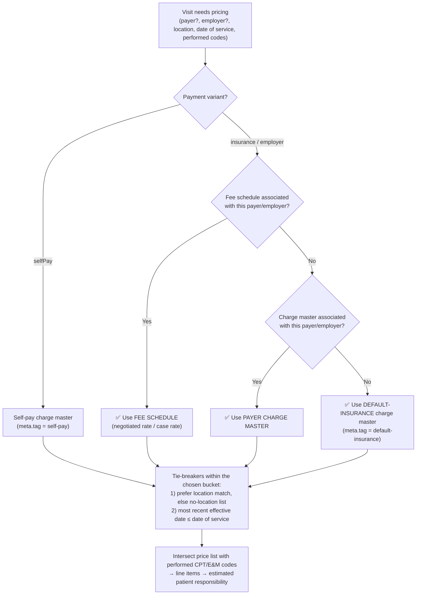
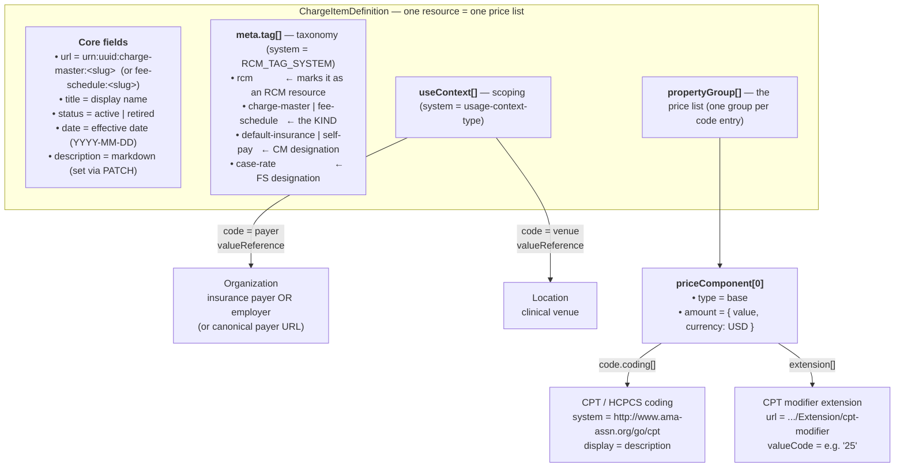
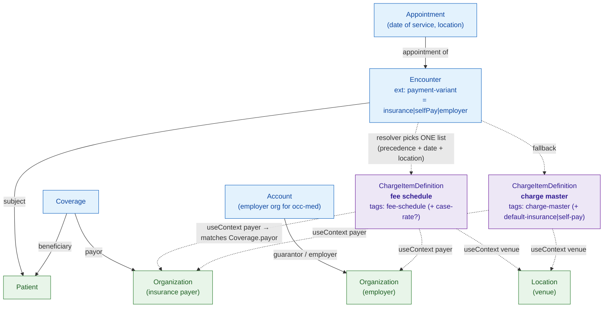
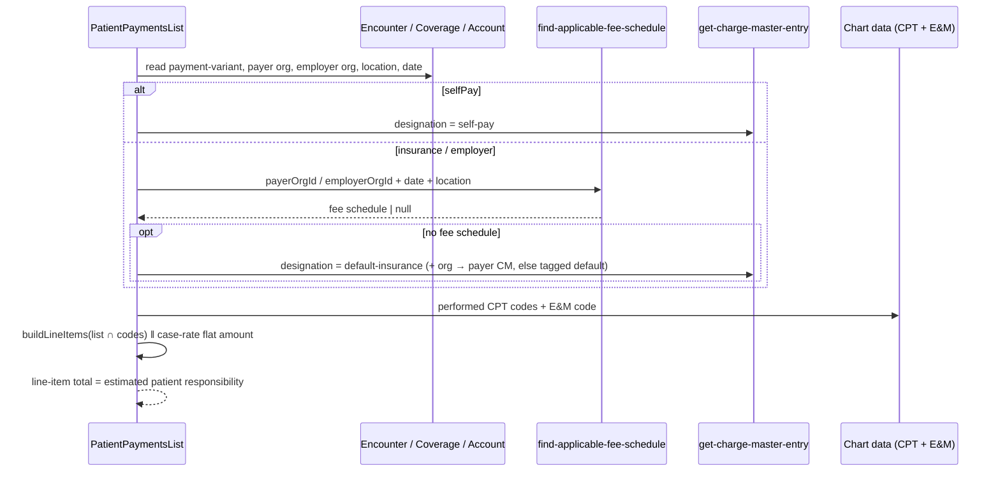

# Chargemaster & Fee Schedules — Product & Technical Design

> Status: Design / reference documentation
> Scope: `apps/ehr` (Admin → Billing), `packages/zambdas/src/rcm/{charge-masters,fee-schedules}`, `packages/utils`
> Audience: Product, RCM/billing stakeholders, and engineers working on revenue-cycle features

---

## 1. TL;DR

**Charge masters** and **fee schedules** are the two pieces of pricing reference data that let Ottehr put a dollar amount on the services rendered during a visit. They are configured by an administrator under **Admin → Billing**, and they are consumed at the point of care to **estimate the patient's financial responsibility** before/at checkout.

- A **charge master** is the list of prices an organization *bills* for each procedure (CPT/HCPCS) code — the "list price" / gross charge.
- A **fee schedule** is the *negotiated reimbursement rate* agreed with a specific insurance payer (or employer) for each code.

Both are modeled with the **same FHIR resource type — `ChargeItemDefinition`** — and are distinguished, scoped, and prioritized entirely through FHIR primitives (`meta.tag`, `useContext`, `propertyGroup.priceComponent`, and the `date` field). When a visit needs pricing, a resolver walks a precedence ladder (fee schedule → payer charge master → default charge master, or self-pay charge master) to pick the single most-applicable `ChargeItemDefinition`, then intersects its price list with the CPT/E&M codes captured on the encounter to produce line items.

---

## 2. Product

### 2.1 Why this exists

Ottehr supports both insurance and self-pay visits. To collect payment at the point of service, to show patients an estimate, and to feed downstream revenue-cycle work, the system has to answer one question:

> **"For *this* visit — given its payer, its employer (if any), its location, its date, and the procedures performed — what should each line cost?"**

Answering that requires two layers of pricing data that the billing team maintains:

1. **What we charge** (charge master) — our standard prices.
2. **What a given payer has agreed to pay** (fee schedule) — the negotiated, contract-specific rates.

These are separated because the *billed* amount and the *contracted/expected* amount are rarely the same number, and because expected rates differ payer-by-payer.

### 2.2 Core concepts

| Concept | What it means in product terms |
|---|---|
| **Charge master** | A named price list of the rates the practice *bills*. Used as the fallback when no negotiated fee schedule applies, and as the basis for self-pay pricing. |
| **Fee schedule** | A named price list of *negotiated reimbursement rates* tied to a specific insurance payer (or employer). Takes precedence over the charge master when one exists for the visit's payer. |
| **Procedure code entry** | A single line in a price list: a CPT/HCPCS code, an optional modifier, a human description, and a dollar amount. |
| **Designation (charge master)** | A charge master can be flagged as the **Default Insurance** list (used for any insured patient without a more specific match) or the **Self-Pay** list (used for uninsured patients). |
| **Case rate (fee schedule)** | A fee schedule can be switched to a **case rate** — a single flat fee for the whole encounter instead of per-code pricing (e.g., a bundled telehealth visit). The alternative is **fee-for-service** (per-code). |
| **Payer association** | Links a price list to one or more insurance payers or employers, so the resolver knows which visits it applies to. |
| **Location association** | Optionally scopes a price list to specific clinical venues, so the same payer can have venue-specific rates. |
| **Effective date** | The date a price list becomes effective. The system always picks the most recent list effective *on or before* the date of service, so historical visits price correctly even after rates change. |
| **Status** | `Active` or `Inactive (retired)`. Only active lists are used for new pricing; inactive ones are retained for history. |

### 2.3 How an administrator uses it

Everything is configured under **Admin → Billing** (`/admin/billing`), which is a tabbed page. The relevant tabs are:

- **E&M Codes** — maps visit complexity to evaluation-and-management CPT codes (the codes that flow into pricing).
- **Insurance** — payer configuration.
- **Fee Schedules** — manage negotiated payer rates.
- **Charge Masters** — manage billed rates and the default/self-pay designations.
- **Employers** — employer organizations (for occupational-medicine / employer-paid visits).
- **Payment Locations**, **Invoicing** — adjacent RCM configuration.

The **Fee Schedules** and **Charge Masters** tabs are intentionally near-identical (they share one component). Each shows a searchable list with an active/inactive indicator, a "Show inactive" toggle, and an "Add new" action. Charge-master rows additionally show **Default Insurance** / **Self-Pay** chips; fee-schedule rows show a **Case Rate** / **Fee-for-Service** chip.

Opening a list opens an editor with tabs:

- **Settings** — name, effective date, rich-text (markdown) description, active/retired status, and (fee schedules) the case-rate toggle + flat amount/comment.
- **Procedures** — add/edit/delete individual code entries; **bulk-import via CSV** with an auto-detected column mapping, a before/after diff (added / removed / changed), and an optional "replace all"; download a CSV template. (Fee schedules also expose a **version history** viewer.)
- **Payers** — associate/disassociate insurance payers and employers.
- **Locations** — associate/disassociate clinical venues.
- **Designation** (charge masters only) — mark the list as Default Insurance or Self-Pay.

The two in-app info banners capture the product intent precisely:

> **Fee schedules** — *"Fee schedules define the expected reimbursement rates negotiated with each insurance payer. When calculating patient responsibility, the system applies the fee schedule associated with the patient's insurance. If no fee schedule is assigned to a given payer, the default insurance charge master rates will be used instead."*

> **Charge masters** — *"Charge masters define the rates billed to a specific insurance payer. When no payer-specific charge master is assigned, the active default insurance charge master will be applied. For patients without insurance coverage, the active self-pay charge master will be used."*

### 2.4 How it's used at the point of care

The payoff is in the **patient payments panel** on a visit (`PatientPaymentsList`). The visit carries a **payment variant** — `insurance`, `selfPay`, or `employer` — recorded on the Encounter. From that, plus the visit's payer, employer, location, and date, the system resolves a single applicable price list and builds an estimate:

1. It reads the **procedures actually performed** from the chart — the encounter's CPT codes and E&M code.
2. It resolves the applicable fee schedule / charge master (see §2.5).
3. It **intersects** the two: for each performed code it finds the matching price-list entry (preferring an exact code+modifier match, then a no-modifier entry, then any modifier) and emits a line item with that amount.
4. The line-item total is the **estimated patient responsibility**; payments already collected are subtracted to show a remaining balance.

For a **case-rate** fee schedule, the per-code intersection is bypassed and the single flat amount is used. The panel also renders a small **E&M rate preview** (99203 / 99204 / 99213 / 99214) so staff can see common visit-level prices at a glance.

> **Scope boundary:** Today this pricing data drives *estimation and point-of-service collection*. The downstream claim/invoice pipeline (`Claim`, `Invoice`, `ChargeItem`, and the Candid Health integration) is a separate subsystem; chargemaster/fee-schedule resources are the **pricing source of truth** that informs the patient-facing estimate rather than directly emitting claim line items. See §3.7.

### 2.5 Resolution rules (the precedence ladder)

For a given visit the system selects exactly one price list. In product terms:

**Insured / employer visit**
1. **Fee schedule** matching the visit's payer (or employer) — the negotiated rate wins if it exists.
2. **Payer-specific charge master** — a charge master explicitly associated with that payer/employer.
3. **Default-insurance charge master** — the catch-all for insured patients.

**Self-pay visit**
1. **Self-pay charge master** — the list designated for uninsured patients.

Within any of those buckets, two refinements apply:
- **Location** acts as a tie-breaker: a list associated with the visit's location beats a list with no location association; lists associated with *other* locations are excluded.
- **Effective date**: among the remaining candidates, the one with the most recent effective date *on or before the date of service* wins.



---

## 3. Technical Design

### 3.1 Architecture at a glance

Three layers, consistent with the rest of Ottehr:

- **FHIR backend (Oystehr)** — the system of record. Every charge master and fee schedule is a `ChargeItemDefinition`.
- **Zambdas** (`packages/zambdas/src/rcm/charge-masters/*`, `.../fee-schedules/*`) — serverless HTTP endpoints that own all create/read/update/delete and resolution logic. Each follows the standard pattern (`index.ts` + `validateRequestParameters.ts`, wrapped by `wrapHandler`, authenticating via a cached M2M token). They are registered in `config/oystehr-core/zambdas.json`.
- **EHR frontend** (`apps/ehr`) — React + MUI admin UI and the point-of-care payments panel, talking to the zambdas through React Query hooks in `apps/ehr/src/rcm/state/{charge-masters,fee-schedules}/`.

### 3.2 FHIR modeling (the core of this design)

#### 3.2.1 Why `ChargeItemDefinition`, and why one type for both

FHIR R4B's `ChargeItemDefinition` is purpose-built to "define properties and rules about how the price and the applicability of a `ChargeItem` can be determined." That is exactly a price list. Rather than introduce two resource types, Ottehr uses **one** `ChargeItemDefinition` per price list and leans on FHIR primitives to express *kind*, *scope*, *designation*, *effectivity*, and *the prices themselves*. A charge master and a fee schedule are therefore **structurally identical** — they differ only by a `meta.tag` and by how the resolver treats them.

#### 3.2.2 Anatomy of a `ChargeItemDefinition`



**Field-by-field:**

- **`url`** — a synthetic business identifier derived from the name, e.g. `urn:uuid:charge-master:standard-2025` / `urn:uuid:fee-schedule:aetna-ppo`.
- **`title`** — the display name shown in the UI.
- **`status`** — `active` or `retired`; the resolver only considers `active` (fee-schedule lookup additionally includes inactive for historical lookups — see §3.3).
- **`date`** — the **effective date**. This single field powers historical correctness: the resolver sorts candidates by `date` and takes the most recent one `<=` the date of service.
- **`description`** — markdown, surfaced read-only on the payments panel. Written via FHIR **PATCH** (add/replace/remove) rather than on the main update, to sidestep FHIR's rejection of empty strings.
- **`meta.tag[]`** — the taxonomy (see below).
- **`useContext[]`** — payer / employer / venue scoping (see below).
- **`propertyGroup[]`** — the price list (see below).

#### 3.2.3 `meta.tag` taxonomy

All tags use **`RCM_TAG_SYSTEM`** = `https://fhir.zapehr.com/r4/StructureDefinitions/rcm`. On creation, `rcmMeta()` stamps two tags — the generic `rcm` marker and the kind:

```jsonc
"meta": { "tag": [
  { "system": "https://fhir.zapehr.com/r4/StructureDefinitions/rcm", "code": "rcm" },
  { "system": "https://fhir.zapehr.com/r4/StructureDefinitions/rcm", "code": "charge-master" } // or "fee-schedule"
]}
```

Additional, mutually-exclusive tags express *designation*:

| Tag code | Applies to | Meaning |
|---|---|---|
| `charge-master` / `fee-schedule` | all | the **kind** (set once at creation) |
| `default-insurance` | charge master | the catch-all list for insured patients |
| `self-pay` | charge master | the list for uninsured patients |
| `case-rate` | fee schedule | flat fee for the encounter instead of per-code |

Tags are also the **search key**: lists are fetched with `_tag=RCM_TAG_SYSTEM|charge-master` (or `|fee-schedule`, `|default-insurance`, `|self-pay`). Designation changes are write operations that strip the prior designation tag and add the new one (and, for charge masters, also clear `useContext` — a designated default/self-pay list is global, not payer-scoped).

> **Note:** a `CHARGE_MASTER_DESIGNATION_EXTENSION_URL` (`https://fhir.ottehr.com/Extension/charge-master-designation`) constant exists but is **unused**; designation is implemented purely via `meta.tag`.

#### 3.2.4 `useContext` — scoping to payers, employers, and venues

`useContext` (a standard `UsageContext`) is how a price list declares *which visits it applies to*. Entries use `system = http://terminology.hl7.org/CodeSystem/usage-context-type`:

| `code.code` | `valueReference` | Purpose |
|---|---|---|
| `payer` | `Organization/{id}` **or** a canonical payer URL | binds the list to an insurance payer **or** an employer organization |
| `venue` | `Location/{id}` | binds the list to a clinical location |

A single resource can carry many entries (multiple payers, multiple venues). Crucially, a **payer reference can take two forms**:

- a local **`Organization/{uuid}`** reference, or
- an Oystehr RCM **canonical payer URL** — `https://rcm-api.zapehr.com/v1/payer/{id}` (produced by `getPayerUrl`).

The helper **`orgIdMatchesReference(reference, orgId)`** treats both forms as equal, so a visit whose `Coverage.payor` is a payer URL still matches a list associated by `Organization` id (and vice-versa). This is the linchpin that joins coverage data to pricing data.

#### 3.2.5 `propertyGroup` / `priceComponent` — the prices

Each **code entry is its own `propertyGroup`**, containing a single `priceComponent`:

```jsonc
{
  "priceComponent": [{
    "type": "base",
    "code": { "coding": [{
        "system": "http://www.ama-assn.org/go/cpt",
        "code": "99214",
        "display": "Office visit, established patient, level 4"
    }]},
    "amount": { "value": 200.00, "currency": "USD" },
    "extension": [{
        "url": "https://fhir.ottehr.com/Extension/cpt-modifier",
        "valueCode": "25"
    }]
  }]
}
```

- **`type: "base"`** — the base price.
- **`code.coding`** — the CPT/HCPCS code (system `http://www.ama-assn.org/go/cpt`); `display` holds the description.
- **`amount`** — `{ value, currency: "USD" }`.
- **CPT modifier** — stored as an **extension** on the price component (`url = https://fhir.ottehr.com/Extension/cpt-modifier`, `valueCode = modifier`), so the same CPT can appear multiple times with different modifiers. Uniqueness is enforced on the **`code|modifier`** pair (HTTP 409 on duplicate).

**Case rate** is the special form: the list is tagged `case-rate`, its `propertyGroup` is collapsed to a single synthetic entry whose `code.coding = [{ code: "case-rate", display: "Case Rate" }]`, `code.text` carries an optional comment, and `amount.value` is the flat fee.

#### 3.2.6 Effective dating & versioning

- **Effective dating** is the `date` field, used by every resolver for the "most recent ≤ date of service" selection.
- **Versioning** rides on **native FHIR resource history**. The `get-version-history` zambda calls `oystehr.fhir.history()` on the `ChargeItemDefinition` and returns each version (`versionId`, `lastUpdated`, full resource), newest first — giving an auditable trail of price changes and rollback material. Every write uses **optimistic locking** via `optimisticLockingVersionId` (`meta.versionId`) to prevent lost updates.

#### 3.2.7 FHIR systems & identifiers reference

| Purpose | System / URL | Constant |
|---|---|---|
| RCM marker / kind / designation tags | `https://fhir.zapehr.com/r4/StructureDefinitions/rcm` | `RCM_TAG_SYSTEM` |
| Procedure code coding | `http://www.ama-assn.org/go/cpt` | `CPT_CODE_SYSTEM` |
| CPT modifier (extension on priceComponent) | `https://fhir.ottehr.com/Extension/cpt-modifier` | `CPT_MODIFIER_EXTENSION_URL` |
| `useContext` type | `http://terminology.hl7.org/CodeSystem/usage-context-type` | (inline) |
| Canonical payer reference | `https://rcm-api.zapehr.com/v1/payer/{id}` | `getPayerUrl` / `extractPayerIdFromUrl` |
| Business identifier (`url`) | `urn:uuid:charge-master:{slug}` / `urn:uuid:fee-schedule:{slug}` | (inline) |
| Encounter payment variant | `https://fhir.ottehr.com/Extension/payment-variant` | `ENCOUNTER_PAYMENT_VARIANT_EXTENSION_URL` |
| Case-rate marker | tag code `case-rate` | `CASE_RATE_CODE` |

#### 3.2.8 How the FHIR model fits together (resource map)

The diagram below shows the resources involved in pricing a visit. **Solid edges are stored FHIR references**; **dashed edges are runtime/derived relationships** (resolved by the resolver, or matched by tag) rather than persisted pointers.



The key insight: there is **no stored reference** from an Encounter/Coverage to a `ChargeItemDefinition`. The join is computed at request time by matching the visit's **payer/employer Organization**, **Location**, and **date of service** against each list's `useContext` and `date`, then applying tag-based precedence.

### 3.3 Resolution algorithm (detailed)

Two zambdas implement resolution; both fetch candidate lists by tag and then filter/sort **in memory** (the precedence and date logic is richer than a single FHIR query can express).

**`find-applicable-fee-schedule`** — fetches `_tag=...|fee-schedule` (**active *and* inactive**, so historical visits resolve to the rate that was effective then):
1. If an **employer** org is given, try fee schedules whose `useContext` references that employer.
2. Otherwise/next, try fee schedules whose `useContext` matches the **payer** (`orgIdMatchesReference`).
3. Within the chosen set: keep `date <= dateOfService`, sort descending by `date`; if a `locationId` is given prefer a location match, else fall back to lists with **no** location associations; return the top, or `null`.

**`get-charge-master-entry`** — the resolver the EHR actually calls for charge masters. Given a `designation` (`default-insurance` | `self-pay`):
1. For `default-insurance` *with* a payer/employer org: search `_tag=...|charge-master`, find **active** lists associated with that org, `date <= cutoff`, newest first, with the same location tie-breaker — returns `source: 'payer'`.
2. Fallback: search `_tag=...|{designation}` (the tagged default-insurance/self-pay list), pick newest active `date <= cutoff` — returns `source: 'chargemaster'`.

> **Implementation note:** a third resolver, **`find-applicable-charge-master`**, implements an end-to-end ladder (employer-specific → payer-specific → default-insurance → self-pay) and is unit-tested, but it is **not wired into the EHR frontend** — the UI composes `find-applicable-fee-schedule` + `get-charge-master-entry` instead. It reads as an alternative/earlier resolver and is a candidate for consolidation (see §5).

### 3.4 Backend endpoint catalog

All under `packages/zambdas/src/rcm/`, registered in `config/oystehr-core/zambdas.json`.

**Charge masters** (`charge-masters/`)

| Zambda | Purpose |
|---|---|
| `create-charge-master` | create CID tagged `charge-master` |
| `list-charge-masters` | list by `_tag\|charge-master` |
| `update-charge-master` | name / date / description / status |
| `delete-charge-master` | delete by id |
| `designate-charge-master-entry` | set `default-insurance` / `self-pay` tag (clears `useContext`) |
| `get-charge-master-entry` | **resolver** used by the EHR (by designation + org/location/date) |
| `find-applicable-charge-master` | standalone resolver (tested; not wired to UI) |
| `cm-associate-payer` / `cm-disassociate-payer` | add/remove `useContext` payer/venue entries |
| `cm-add-procedure-code` / `cm-update-procedure-code` / `cm-delete-procedure-code` | per-code edits |
| `cm-bulk-add-procedure-codes` | CSV bulk import (optional replace-all) |

**Fee schedules** (`fee-schedules/`)

| Zambda | Purpose |
|---|---|
| `create-fee-schedule` | create CID tagged `fee-schedule` |
| `list-fee-schedules` | list by `_tag\|fee-schedule` |
| `update-fee-schedule` | name / date / description / status + **case-rate** designation & amount |
| `delete-fee-schedule` | delete by id |
| `find-applicable-fee-schedule` | **resolver** (payer/employer + date + location) |
| `add-procedure-code` / `update-procedure-code` / `delete-procedure-code` | per-code edits |
| `bulk-add-procedure-codes` | CSV bulk import |
| `associate-payer` / `disassociate-payer` | add/remove `useContext` payer/venue entries |
| `get-version-history` | FHIR `history()` over the CID (audit/rollback) |

### 3.5 Frontend

- **State / data access:** `apps/ehr/src/rcm/state/charge-masters/` and `.../fee-schedules/` — each has an `*.api.ts` (typed wrappers over the zambdas) and `*.queries.ts` (React Query hooks: list/create/update/associate/procedure-code mutations, plus `useFindApplicableFeeScheduleQuery`, `useGetChargeMasterEntryQuery`).
- **Admin UI** (shared between both modes via a `mode: 'fee-schedule' | 'charge-master'` prop):
  - `features/admin/BillingConfiguration.tsx` — the tabbed Billing page.
  - `.../telemed/components/admin/ChargeItemList.tsx` — the list view.
  - `.../telemed/components/admin/EditChargeItem.tsx` — the editor (Settings / Procedures / Payers / Locations / Designation tabs).
  - `.../admin/charge-items/{ProcedureCodes,PayerAssociations,LocationAssociations}.tsx` — the editor sub-panels (CSV import lives in `ProcedureCodes`).
  - Routes: `/admin/billing/:billingTab`, `/admin/fee-schedule/:id`, `/admin/charge-masters/:id`.
- **Point-of-care UI:** `apps/ehr/src/components/PatientPaymentsList.tsx` — orchestrates resolution + estimate (next section).

### 3.6 Point-of-care consumption (`PatientPaymentsList`)



`buildLineItems` matching order per performed code: **exact code+modifier** → **code with no modifier** → **code with any modifier**; amount comes from `priceComponent.amount.value`. `buildEmPreviewRates` surfaces 99203/99204/99213/99214 prices from the resolved list.

### 3.7 Relationship to the wider RCM model

The pricing layer sits beside, but is distinct from, the claims/billing layer:

- **`Coverage`** — the join point: its `payor` Organization (or payer URL) is what `useContext` matches against. **`Account`** carries the employer organization for occupational-medicine/employer visits.
- **`Claim` / `ChargeItem` / `Invoice` / `PaymentReconciliation`** — the downstream revenue-cycle resources (claims queue, invoicing, payment tracking), populated largely via the **Candid Health** integration. These are **not** currently generated directly from `ChargeItemDefinition`; the chargemaster/fee-schedule resources inform the **patient-facing estimate** and point-of-service collection rather than emitting claim line items. A natural future link is to materialize estimated line items into `ChargeItem`s referencing the resolved `ChargeItemDefinition`.

---

## 4. Design decisions & trade-offs

- **One resource type for two concepts.** Charge masters and fee schedules share `ChargeItemDefinition` and 90% of their code; they diverge only by tag and resolver treatment. Pro: minimal surface area, shared UI/zambda patterns. Con: "kind" and "designation" live in tags, so correctness depends on tag discipline rather than the type system.
- **Tags over extensions for kind/designation.** Using `meta.tag` makes lists directly searchable via `_tag` and keeps the resolver queries simple. (The unused designation *extension* constant is a vestige of an earlier approach.)
- **In-memory precedence, not pure FHIR search.** Candidates are fetched by tag, then precedence + effective-date + location tie-breaking happen in code. This keeps the nuanced ladder readable at the cost of pulling all lists of a kind into memory (fine at expected catalog sizes).
- **Per-code `propertyGroup`.** Modeling each CPT/modifier as its own group (rather than many components in one group) makes add/update/delete-by-index and duplicate detection straightforward, and matches how the UI edits one row at a time.
- **Description via PATCH; writes via optimistic locking.** Avoids FHIR's empty-string rejection and protects against concurrent edits.
- **Fee-schedule lookup includes inactive lists; charge-master lookup does not.** Fee schedules must resolve historically (a claim/estimate for an old date should use the rate effective then), so retired schedules remain eligible; charge masters are treated as current-state pricing.
- **Dual payer reference forms.** Supporting both `Organization/{id}` and canonical payer URLs (via `orgIdMatchesReference`) lets the same list match regardless of how a given `Coverage` happens to reference its payer.

---

## 5. Observations & future work

- **Resolver consolidation.** `find-applicable-charge-master` duplicates much of `get-charge-master-entry` but isn't used by the UI; consider unifying into a single charge-master resolver (or a single resolver that returns fee-schedule-or-charge-master with a `source`).
- **Estimate → claim linkage.** Resolved line items are not yet persisted as `ChargeItem`s; doing so would tie point-of-service estimates to the downstream claim/invoice pipeline and create an auditable price-at-time-of-service record.
- **Version-history parity.** `get-version-history` is generic but surfaced primarily for fee schedules in the UI; exposing it for charge masters too would round out auditability.
- **Tag-integrity guards.** Because kind/designation live in tags, server-side invariants (e.g., exactly one active `default-insurance` and one `self-pay` charge master; a list can't be both kinds) would harden the model against bad writes.

---

## Appendix — file map

| Area | Path |
|---|---|
| Charge-master zambdas | `packages/zambdas/src/rcm/charge-masters/*` |
| Fee-schedule zambdas | `packages/zambdas/src/rcm/fee-schedules/*` |
| Shared `rcmMeta()` | `packages/zambdas/src/shared/helpers.ts` |
| FHIR constants/systems | `packages/utils/lib/fhir/constants.ts`, `packages/utils/lib/fhir/systemUrls.ts` |
| Payer-reference helpers | `packages/utils/lib/helpers/helpers.ts` (`getPayerUrl`, `orgIdMatchesReference`, `extractPayerIdFromUrl`) |
| Payment variant (Encounter) | `packages/utils/lib/fhir/encounter.ts` (`PaymentVariant`, `getPaymentVariantFromEncounter`) |
| Admin Billing page | `apps/ehr/src/features/admin/BillingConfiguration.tsx` |
| List view (shared) | `apps/ehr/src/features/visits/telemed/components/admin/ChargeItemList.tsx` |
| Editor (shared) | `apps/ehr/src/features/visits/telemed/components/admin/EditChargeItem.tsx` |
| Editor sub-panels | `apps/ehr/src/features/visits/telemed/components/admin/charge-items/{ProcedureCodes,PayerAssociations,LocationAssociations}.tsx` |
| Frontend state/queries | `apps/ehr/src/rcm/state/{charge-masters,fee-schedules}/` |
| Point-of-care estimate | `apps/ehr/src/components/PatientPaymentsList.tsx` |
| Zambda registration | `config/oystehr-core/zambdas.json` |
| Tests | `packages/zambdas/test/unit/find-applicable-*.test.ts`, `packages/zambdas/test/rcm/cm-*.test.ts`, `apps/ehr/tests/component/ProcedureCodes.test.tsx`, `apps/ehr/tests/e2e/specs/admin/feeScheduleAdmin.spec.ts` |
