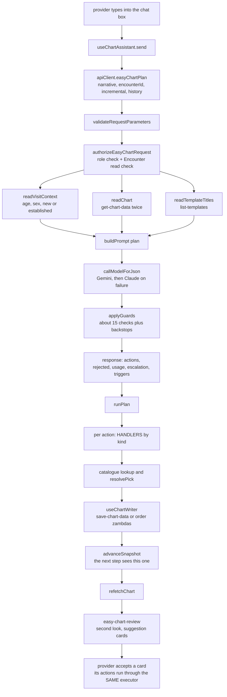
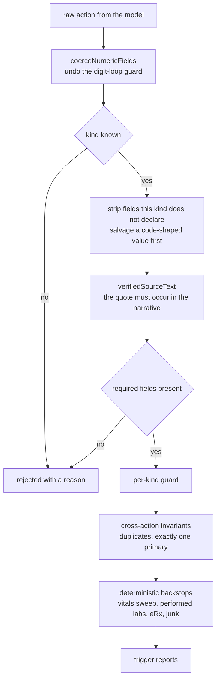
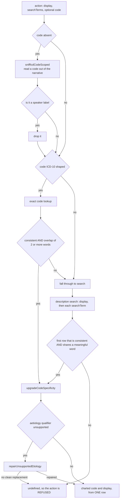

# Easy Chart — Technical Design

How a sentence a provider types in a chat box becomes rows in a FHIR chart. Written to be read
top-to-bottom by someone who has never opened the feature.

Every claim here has a code reference. Where a design decision looks arbitrary, the reason is stated —
almost all of them come from a specific measured failure.

---

## 1. The one architectural idea

**The model never writes to the chart. It returns typed actions from a closed vocabulary, and
deterministic code executes them through the same chart endpoints the regular EHR pages use.**

That single constraint is what the rest of the design falls out of:

| consequence                                                                                          | where it lives                                                            |
| ---------------------------------------------------------------------------------------------------- | ------------------------------------------------------------------------- |
| every action kind is declared once, with its required fields, its surfaces and its chart target      | [`registry.ts`](../packages/utils/lib/easy-chart/registry.ts)             |
| the model's response schema is _generated_ from that registry, so schema and vocabulary cannot drift | [`schema.ts`](../packages/utils/lib/easy-chart/schema.ts)                 |
| an action the build does not know is refused with a reason, never silently dropped                   | [`guards.ts`](../packages/zambdas/src/ehr/easy-chart-shared/guards.ts)    |
| codes are confirmed against the terminology service, never trusted from the model                    | [`icd-resolve.ts`](../packages/utils/lib/easy-chart/icd-resolve.ts)       |
| execution is a loop over handlers, one per kind, testable against a fake chart                       | [`handlers.ts`](../apps/ehr/src/features/easy-chart/executor/handlers.ts) |

The vocabulary is 34 kinds on the planning surface and 10 on the review surface.

---

## 2. The whole flow



---

## 3. The browser side: what happens on send

Entry point: [`useChartAssistant.ts:75`](../apps/ehr/src/features/easy-chart/hooks/useChartAssistant.ts#L75).

### 3.1 What is sent

```ts
apiClient.easyChartPlan({
  narrative: message, // what the provider typed, or a transcript
  encounterId: options.encounterId,
  incremental: history.current.length > 0, // every turn after the first
  history: history.current.slice(-HISTORY_TURNS),
});
```

**That is the whole payload.** No chart state, no note text, no exam findings.

This is deliberate and it is recent. The client used to assemble a prose summary of the chart and post
it. Three things were wrong with that, and all three showed up as _missing data_:

1. the client could only describe the sections its own read layer happened to fetch — ROS, vitals and
   already-placed orders were silently absent, so the model re-charted them;
2. the two sides drifted every time a field was added to one of them;
3. a caller-assembled summary is caller-controlled text landing inside the model's instructions.

The visit-note PDF path never had this problem because it reads the chart server-side
([`assemble-progress-note-input.ts:41`](../packages/zambdas/src/shared/pdf/assemble-progress-note-input.ts#L41)).
The zambda now does the same.

### 3.2 `incremental` and the conversation digest

`incremental: true` from the second turn onward. It changes the prompt: the model is told the note is
already written and to chart only what is new. Getting this wrong is expensive in both directions — a
first dictation for a patient with intake history has a non-empty chart and still needs the full pass,
which is why the flag is derived from the _conversation_, not from whether the chart is empty
([`prompt.ts:243`](../packages/utils/lib/easy-chart/prompt.ts#L243)).

`history` is a bounded digest, capped in
[`validateRequestParameters.ts`](../packages/zambdas/src/ehr/easy-chart-plan/validateRequestParameters.ts)
at `MAX_HISTORY_TURNS = 6` and `MAX_HISTORY_CHARS = 6000`. Provider turns are quoted verbatim (what was
said is evidence); assistant turns are summarised to one line per action (what it did is already in the
chart state). Every turn re-sends the window, so an uncapped one makes cost grow superlinearly.

---

## 4. Inside the zambda: where every prompt input comes from

Handler: [`easy-chart-plan/index.ts`](../packages/zambdas/src/ehr/easy-chart-plan/index.ts).

### 4.1 Authorisation, first

[`authorize.ts`](../packages/zambdas/src/ehr/easy-chart-shared/authorize.ts) runs before anything reads
data. Two checks:

1. the caller's roles include one of `EASY_CHART_ROLES`;
2. when an `encounterId` was supplied and the caller is a _user_, that user's own token is used to `GET`
   the Encounter. A 403/404 denies. Without this, any authenticated token could plan against any
   encounterId and read that visit's chart back through the prompt.

A machine-to-machine token has no user profile and could never pass a role check, so it is recognised
and the role check is skipped — that is what lets the eval harness run.

### 4.2 The four reads

| prompt input                                  | source                                                       | code                                                                                 |
| --------------------------------------------- | ------------------------------------------------------------ | ------------------------------------------------------------------------------------ |
| `patientLine` — age, sex                      | Encounter → Patient, `_include=Encounter:subject`            | [`visit-context.ts`](../packages/zambdas/src/ehr/easy-chart-shared/visit-context.ts) |
| `patientStatus` — new / established           | Appointment count for the patient in the last 3 years        | same file                                                                            |
| `chartStateSummary` — everything on the chart | `getChartData` **twice**                                     | [`chart-state.ts`](../packages/utils/lib/easy-chart/chart-state.ts)                  |
| `templateTitles`                              | `list-templates` zambda's `performEffect`, called in-process | `readTemplateTitles`                                                                 |

**Why `getChartData` twice.** `get-chart-data` has two classes of field: the default set, and fields it
fetches _only_ when named. Omitting one of the second class does not error — it returns an empty
section, which is how hospitalizations were invisible for weeks. So: one unscoped call, one with
`progressNoteChartDataRequestedFields` — the same pair, and the same field list, the visit-note PDF uses.

```ts
const [base, scoped] = await Promise.all([
  getChartData(oystehr, token, encounterId),
  getChartData(oystehr, token, encounterId, progressNoteChartDataRequestedFields),
]);
return { ...base.response, ...scoped.response }; // scoped is authoritative for its keys
```

**Why `patientStatus` matters enough to have its own lookup.** It picks the E&M code _family_:
99202-99205 for a new patient, 99212-99215 for an established one. Measured on the harvested corpus: when
the model is told the status it picks the right family **11 of 11 times**; when it is not told, the prompt
falls back to the established family and every new-patient visit is mis-coded. The chart always wins over
a caller-supplied value.

**Why `templateTitles` is load-bearing.** The prompt says to match the practice's titles exactly and never
invent one. With no list the tail renders `AVAILABLE TEMPLATES in this practice: none. Do NOT emit
apply-template.` — so a missing list does not degrade templates, it **disables** them. Nothing was passing
them until recently, which is why the eval reported zero templates applied on every run.

### 4.3 What the chart summary contains

[`buildChartStateSummary`](../packages/utils/lib/easy-chart/chart-state.ts) emits one line per item (values below are invented):

```
- Diagnosis (primary): Acute sinusitis, unspecified [J01.90]
- Allergy: Penicillin
- Past medical history: Asthma
- Medication: Albuterol
- Surgical history: Appendectomy
- Hospitalization: Pneumonia, 2019
- In-house medication given: Ketorolac
- Prescription already ordered: Amoxicillin
- Procedure already charted: Laceration repair
- Vital already recorded: vital-blood-pressure = 122/78
- ROS already charted: Denies Constitutional: Fever
- Radiology already ordered: Chest X-ray
- External lab already ordered: CBC
- CPT: 87880 Rapid strep
- E&M code already set: 99213
- Disposition already set: pcp
- Patient instruction: Keep the wound clean and dry…
```

Displays, not ids — for two reasons. The model must know an item **exists** so it neither duplicates it
nor invents a removal; and it must be able to name it back exactly, because the server's removal guard
matches a `remove-*` against these very lines.

Exam findings travel **separately** as `chartedExamFindings`
([`chartedExamFindingLabels`](../packages/utils/lib/easy-chart/chart-state.ts)) because the prompt says a
different thing about them: exam boxes are positive/abnormal assertions, so "already checked" means
something the note is _claiming_, not merely something present.

ROS is read from `rosObservations`. Not from `observations` — a different key, empty on every response
observed.

---

## 5. The prompt

[`prompt.ts`](../packages/utils/lib/easy-chart/prompt.ts). One function, two surfaces:

```ts
buildPrompt(surface, tail) = buildStaticInstructions(surface) + FIXED_INSTRUCTIONS_END + buildVariableTail(tail);
```

### 5.1 Static prefix first, and why

The static half is **8 200 tokens** — about 81 % of a typical call. It is byte-identical across calls
and is emitted first so it can be cached by the provider. Callers must not interpolate anything into it;
a test pins that every per-visit block renders _after_ the `═══ END OF FIXED INSTRUCTIONS` marker
([`easy-chart-review-coherence-swap.test.ts`](../packages/zambdas/test/easy-chart-review-coherence-swap.test.ts)).

> **Open issue.** Measured cache reads are **zero** across 40 calls. The ordering is right; whether the
> provider is crediting the cache is unverified, and until it is, the full price is being paid.

The static prefix is built from three parts:

1. `PLAN_PREAMBLE` — the role, and the closed-vocabulary rule;
2. `PLAN_ORDERING` — the 11 numbered steps, in chart order (template → note text → vitals → exam → ROS →
   diagnoses → labs → procedures → disposition → billing). Step 7 carries `STATED DIAGNOSIS WINS`: a
   diagnosis the provider named is charted as-is, and flank tenderness does not upgrade a stated UTI to
   pyelonephritis;
3. `actionShapesBlock(surface)` — generated by walking the registry and printing each capability's
   `promptDoc`. The model's list of available actions and the code's list are the same list.

### 5.2 The variable tail

In order: template titles → patient line → patient status → current note text → **ALREADY ON THE CHART** →
incremental notice → conversation digest → **the narrative** → `MUST ADDRESS THIS CALL`.

The empty-chart case is spelled out rather than omitted: `ALREADY ON THE CHART: nothing. The chart is
currently EMPTY … so there is NOTHING to remove. Do NOT emit any remove-* step.` An absent block reads as
an unknown, and the model invented removals.

`mustAddress` is a deterministic override, used by the review surface for the disposition check. Left to
the model's judgement that check fired at 53 % → 36 % → 35 % across runs of the _same corpus with no code
change_, so the narrative is scanned in code and a hit with nothing charted becomes a forced instruction
([`detectDispositionLanguage`](../packages/utils/lib/easy-chart/sniffers.ts)).

---

## 6. The model call

[`model.ts`](../packages/zambdas/src/ehr/easy-chart-shared/model.ts).

```
primary: gemini-3.1-flash-lite      (constrained decoding against a JSON schema)
backup:  claude-haiku-4-5-20251001  (on repeated failure)
```

`callModelForJson(prompt, schema, secrets, name, validator)` — retry once, then escalate. What counts as
a failure worth escalating: empty response, unparseable JSON, `MAX_TOKENS`, timeout, **and a response the
validator rejects**. That last one matters: a structurally valid but semantically empty answer used to
consume the retry budget silently.

Every call returns `{ parsed, usage, escalation }`. `usage` is per-provider and includes cache reads, so a
regression in prompt ordering is visible as a number rather than as a bill.

### 6.1 The digit-loop guard

[`schema.ts`](../packages/utils/lib/easy-chart/schema.ts) declares every numeric field as `string`.

This looks wrong and is not. Under constrained decoding a JSON _number_ has no closing token — the
decoder can always emit another digit — and 31 % of one planner run died at `MAX_TOKENS` mid-number. Every
numeric field is therefore a string in the schema and coerced back on arrival by `coerceNumericFields`,
called first thing in `guardOne`. A value that does not parse is **deleted**, so the required-fields gate
rejects it honestly instead of charting `NaN`.

### 6.2 The response schema is generated

```ts
fieldsForSurface(surface)   // union of every capability's required + optional fields
  → one flat object schema per action, required: ['kind'], kind enum = capabilitiesForSurface(surface)
```

One flat object for all kinds is a real limitation with a real consequence: `isPrimary` **cannot** be made
required for `add-diagnosis` only — it would become required on every action of every kind. Measured, the
model emits it **0 times out of 13**. That is why the fix is deterministic promotion in a guard, not a
schema change and not a prompt sentence.

### 6.3 The schemas, concretely

Two schemas are generated, one per surface, both from the registry. There is no hand-written schema
anywhere — [`schema.ts`](../packages/utils/lib/easy-chart/schema.ts) is 160 lines and most of it is
comments explaining two traps.

#### The plan schema

```json
{
  "type": "object",
  "properties": {
    "actions": {
      "type": "array",
      "items": {
        "type": "object",
        "properties": {
          "kind": { "type": "string", "enum": ["apply-template", "add-diagnosis", "…34 kinds…"] },
          "display": { "type": "string" },
          "searchTerms": { "type": "array", "items": { "type": "string" } },
          "code": { "type": "string" },
          "isPrimary": { "type": "boolean" },
          "field": { "type": "string" },
          "newText": { "type": "string" },
          "text": { "type": "string" },
          "finding": { "type": "string", "enum": ["reports", "denies"] },
          "strength": { "type": "string" },
          "doseForm": { "type": "string" },
          "dispositionType": { "type": "string", "enum": ["pcp", "specialty", "ed", "another", "ip"] },
          "followUpInDays": { "type": "string" },
          "procedureMatch": { "type": "string" },
          "updates": {
            "type": "array",
            "items": {
              "type": "object",
              "properties": { "field": { "type": "string" }, "value": { "type": "string" } },
              "required": ["field", "value"]
            }
          },
          "message": { "type": "string" },
          "sourceText": { "type": "string" }
        },
        "required": ["kind"]
      }
    }
  },
  "required": ["actions"]
}
```

**17 declared fields, 34 kinds, and `kind` is the only required one.** Read that again, because it is
the single most surprising thing about this schema and it is deliberate.

#### Trap 1: every numeric field is a `string`

`followUpInDays` is `{ "type": "string" }`. So are `value`, `systolic` and `diastolic` on the surfaces
that declare them. A test asserts that **no** generated schema ever contains `type: "number"`
(`findNumberTypedFields`).

The reason: Vertex/Gemini structured output uses constrained decoding, and **a JSON number has no
closing token**. The decoder can always emit one more digit. When the model puts a numeric field on an
action where it is meaningless — `"value": 0.` on an `add-diagnosis` — the digit run self-reinforces at
temperature 0 and runs to the output cap. **In one measured planner run, 31 % of calls died at
`MAX_TOKENS` this way.**

The numeric contract is restored immediately after parse, first thing in `guardOne`:

```ts
coerceNumericFields(action); // "7" → 7,  "about 5" → field DELETED
```

Deleting rather than keeping matters: a half-parsed `"value": "about 5"` must never reach a chart write,
and deleting makes the required-fields gate reject it honestly instead of charting `NaN`.

> **Consequence to remember.** The backstops in §7.9 append actions _after_ `guardOne` has run, so
> anything numeric they add must already be a number — nothing downstream will convert it. That was a
> live bug: the vitals sweep pushed `value: String(sniffed.value)`, and the string travelled all the way
> to the chart write. Pinned by a test now.

#### Trap 2: one flat shape for all 34 kinds

Every action shares one property set, all optional except `kind`. The clean design would be a
discriminated `anyOf` — `add-diagnosis` declares `code` and `isPrimary`, `set-vital` declares `field` and
`display`, and nothing else is even expressible. That would also make trap 1 structurally impossible.

It is not used because **constrained decoding handles `anyOf` poorly**. The comment in the file is
explicit that if you want to revisit it, you must measure it rather than assume.

Two real costs follow from the flat shape, and both are visible elsewhere in this document:

1. **`isPrimary` cannot be made required for `add-diagnosis` only** — it would become required on every
   action of every kind. Measured compliance without it: **0 of 13**. Hence the deterministic promotion
   in §7.8, which is code, not a prompt sentence and not a schema change.
2. **Fields leak between kinds**, because the schema permits it. Observed: `strength: "true"` on a
   diagnosis, and `updates: [{field:'code', value:'S01.81XA'}]` — `update-procedure`'s shape — on an
   `add-diagnosis`. §7.1 strips them, and salvages a code out of them first.

#### What the model may emit, per kind

The schema itself cannot express "this kind needs these fields", so the constraint lives in two other
places, both generated from the same registry entry:

| layer                                 | what it does                                                                                     | code                                                          |
| ------------------------------------- | ------------------------------------------------------------------------------------------------ | ------------------------------------------------------------- |
| the prompt's `promptDoc`              | tells the model the shape in prose: `- set-vital: { kind, field, display } — field is one of: …` | [`registry.ts`](../packages/utils/lib/easy-chart/registry.ts) |
| `missingRequiredFields(kind, action)` | rejects at runtime with a reason naming the missing field                                        | `guardOne`                                                    |

So the _schema_ says `{ kind }` is enough; the _registry_ says `add-diagnosis` needs `display`, and an
action without it is refused with `"the model did not supply display"`. The model is told the truth in
prose and held to it in code.

A worked example — `set-vital` declares `required: ['field', 'display']` and **nothing numeric**:

```json
{ "kind": "set-vital", "field": "vital-blood-pressure", "display": "176/92" }
```

The model is asked for the reading _as the provider said it_ — `"98.9 F"`, `"5'8\""`, `"130lb"`,
`"1.73 m"` — and the server parses and converts it (`parseVitalDisplay`, `canonicalizeVitalUnit`).
`value`/`systolic`/`diastolic` are **server-derived**, which is why they are absent from the plan
surface's 17 fields even though `NUMERIC_FIELDS` lists them: they exist for the surfaces and code paths
that do carry them.

#### Field order is part of the cache key

Properties are emitted by iterating `ACTION_FIELDS`, not by iterating a `Set`. The serialized schema
travels with the prompt, so a reordering changes the cached prefix. Do not reorder for cosmetics.

#### The review schema is a different shape

Review does not return bare actions — it returns **cards**, because accepting a card must need no new
charting logic:

```json
{
  "type": "object",
  "properties": {
    "suggestions": {
      "type": "array",
      "items": {
        "type": "object",
        "properties": {
          "category": {
            "type": "string",
            "enum": ["med-name", "diagnosis", "pertinent-negative", "em-level", "secondary-dx",
                     "med-reconcile", "disposition", "cpt", "coherence", "dropped-commitment"]
          },
          "question":    { "type": "string" },
          "rationale":   { "type": "string" },
          "highlight":   { "type": "string" },
          "partial":     { "type": "boolean" },
          "partialNote": { "type": "string" },
          "actions":     { "…the same actions array, but with the review surface's 10-kind enum…" }
        },
        "required": ["category", "question", "actions"]
      }
    }
  },
  "required": ["suggestions"]
}
```

The `actions` sub-schema is literally lifted out of `buildResponseSchema('review')`, so the two surfaces
cannot disagree about what an action looks like. The `kind` enum there is the **10** kinds whose
capability lists `'review'` in `surfaces`:

```
remove-medication, edit-note-text, add-ros-finding, add-diagnosis, remove-diagnosis,
set-em-code, add-cpt, remove-cpt, set-disposition, provider-note
```

`category` is an enum, and a test asserts the enum matches the numbered `N) "category"` list in the
review prompt — the two are written in different files and drifted once.

`partial` / `partialNote` exist for one real case: the `med-name` check corrects a garbled drug name in
the note text but **cannot create the eRx order**, so the card says so out loud rather than implying the
prescription was handled.

#### The wrong shape is a silent, total failure

`buildResponseSchema('review')` returns `{ actions }`. `buildReviewResponseSchema()` returns
`{ suggestions }`. Requesting the first while parsing `raw.suggestions` produces a model answer in a
shape the handler never reads — every call fails, and nothing in the type system objects, because both
are `Record<string, unknown>`. That exact mistake was made and caught only by the category-enum test.
If you touch this, the guard is: **the schema you request and the key you parse must be read together.**

#### Getting the schema in your hands

```bash
npx tsx -e "import('./packages/utils/lib/easy-chart/schema.ts').then(m =>
  console.log(JSON.stringify(m.buildResponseSchema('plan'), null, 2)))"
```

---

## 7. The guards

[`guards.ts`](../packages/zambdas/src/ehr/easy-chart-shared/guards.ts). Everything here runs before the
client sees an action, and **nothing here is silent**: a refused action comes back in `rejected[]` with a
reason the UI renders as "skipped because…". Silent no-ops are the worst failure mode in this product.



### 7.1 Field-leak stripping, and the salvage

Fields not declared by the kind are deleted (`allowedFields(kind)`). Two observed leaks:
`strength: "true"` on a diagnosis (apparently to fake primacy), and — on a forehead laceration —
`updates: [{field:'code', value:'S01.81XA'}]`, which is `update-procedure`'s shape carrying **the correct
code** while the action's own `code` named an unrelated condition.

So before stripping, a code-shaped value inside a leaked field is salvaged as a **candidate**. It then goes
through the same terminology confirmation as any other, so a bad salvage is rejected by the normal path.
This is justified only because code lookup is reliable while description search is not — see §7.3.

### 7.2 Provenance

`verifiedSourceText(action.sourceText, narrative)` — the model's quote must actually occur in the
narrative. A fabricated citation is dropped and the item is honestly marked _inferred_ instead. Done
before anything else, so no later rejection reason can contain an unverified quote.

### 7.3 Diagnosis codes — the deepest part of the system

Pipeline: [`resolveIcd`](../packages/utils/lib/easy-chart/icd-resolve.ts).



**THE INVARIANT: the charted `{code, display}` pair comes from one terminology row.** Never a model code
under a searched display — that is how a note asserts a condition whose code says something else.

**`consistent()`** is five predicates, each written for a specific miscode
([`icd-contradictions.ts`](../packages/utils/lib/easy-chart/icd-contradictions.ts)):

| predicate                      | the failure it was written for                                                                                                           |
| ------------------------------ | ---------------------------------------------------------------------------------------------------------------------------------------- |
| `contradictsQualifiers`        | left/right, upper/lower, which finger, laceration vs puncture. A "right index finger" laceration once charted the right-**thumb** code   |
| `contradictsAnatomy`           | a palm splinter resolving to an **eyelid** foreign-body code because "retained foreign body" matched                                     |
| `contradictsInjuryRegion`      | S-chapter codes are partitioned by body region in the digit after the S; a dictated **tailbone** contusion attached to a head-block code |
| `contradictsHistoryContext`    | "history of recurrent ingrown hairs" charting Z87.01 "Personal history of pneumonia (recurrent)" on `history`+`recurrent` alone          |
| `unsupportedContextQualifiers` | a code asserting childbirth, the newborn period or an intraoperative complication when the visit describes none                          |

**Why an overlap floor is needed on top of them.** The predicates only catch a candidate that
_contradicts_ the intent — and a completely unrelated condition contradicts nothing. Real example:
searching `laceration` for a forehead laceration returned `M89.38 Hypertrophy of bone, other site` as its
top row, no predicate objected, and that is what got charted for a 9-year-old's scooter injury. The floor
is _one_ shared meaningful word, not two, because `strep throat` legitimately resolves to
`Streptococcal pharyngitis` on one shared stem. It is synonym-aware, or `Yeast infection` → `B37.9
Candidiasis` breaks.

**The measured asymmetry that shapes all of this:**

```
[code] "S01.81XA"                → exact row, every time
"strep throat"                   → J02.0 first
"Acute otitis media, right ear"  → H66.91 first
"laceration of scalp"            → birth injuries, naevi, perineal tears
"open wound of forehead"         → amputation-stump dehiscence, obstetric haematoma
```

Code lookup is reliable. Description search is good for medical-register terms and **cannot reach the
S-chapter at all**. That is why the salvage in §7.1 exists, and why refusing is often the correct outcome.

**`upgradeCodeSpecificity`** enumerates the whole 3-character category (paged to 1 000 rows — S93 alone has
336 billable codes) and upgrades when the narrative names a laterality or recurrence the code does not
carry, and _exactly one_ sibling encodes it. Zero or several candidates keep the current code: never
cross-condition, never a downgrade.

**`repairUnsupportedEtiology`** — repair before refusing. The condition is usually right and only the
qualifier is wrong: "Gonococcal vulvovaginitis" for a yeast narrative, "serous" otitis media for a
purulent one. It re-searches with the unsupported qualifier stripped and each _supported_ one substituted,
and accepts the first candidate that keeps every base condition token, keeps the laterality, carries no
unsupported qualifier of its own, and can stand alone.

**The search itself** ([`icd-search.ts`](../packages/zambdas/src/ehr/easy-chart-shared/icd-search.ts)):
the same call shape as the EHR's diagnosis picker, cursor-paged, wrapped in a lay-register expansion layer
(`yeast` → `candidiasis`) and a warm-invocation promise cache. Failures **propagate** — a dead terminology
service must fail the invocation rather than let unvalidated codes through.

### 7.4 CPT and HCPCS

`guardEmCode` / `guardCpt` → `searchCpt` / `searchHcpcs`, strict code match. Three outcomes, and the
distinction is the whole point:

```
{code, display}  → validated, both fields taken from that row
undefined        → the service answered and the code is not real → DROP
'degraded'       → the service was unreachable → KEEP the model's code, report to Sentry
```

Collapsing the last two into "drop" means a terminology outage silently strips billing from every visit
for as long as it lasts, and nobody notices until the invoices are short. An unvalidated billing code for
the duration of an outage is the lesser harm.

### 7.5 Vitals

`guardVital` — the field must be a known vital; a missing reading is recovered from the provider's own
words (`recoverVitalReading`); units are canonicalised through one table shared with the regular vitals
cards, so Easy Chart and those cards cannot disagree by a rounding rule. An implausible height (below
20 in / 51 cm — under any live birth length) is treated as a mis-stated unit and the provider is asked,
because charting 5.8 in silently would put a 15 cm patient in the record.

### 7.6 Exam and ROS

`guardExamFinding` refuses a **normal** dressed as a finding. Exam checkboxes are positive/abnormal
assertions, so charting "no tragus tenderness" would tick the abnormal box and assert the opposite of what
the provider said. ROS is the exception — a denial _is_ a chartable ROS entry — and `guardRosFinding`
takes its polarity from the display text, treating any structured `finding` enum as a secondary signal.

### 7.7 Removals

`guardRemoval` accepts a `remove-*` only when its target appears in `chartedItems` — the same lines the
prompt showed the model, matched by containment in either direction. An empty chart refuses every removal
with "the chart is empty, so there was nothing to remove". This is the direct reason §4.3's coverage
matters: a section missing from the summary is a section nothing can be removed from.

### 7.8 Cross-action invariants

`enforceDiagnosisInvariants` — no duplicate code, and **exactly one primary**:

- more than one marked → all but the first demoted, with a `caution` (demote rather than drop: the
  diagnosis is real, only the flag is wrong);
- **none marked → the first is promoted.** 0 of 13 measured compliance; without this every note is
  billing-invalid, since the E&M code attaches to the primary diagnosis;
- on an incremental turn where the chart already has a primary, new diagnoses are additions and never
  usurpers.

Promotion is gated behind `promoteMissingPrimary`, set only by the planning surface. Review is guarded one
suggestion at a time and its "secondary-dx" card deliberately adds a single diagnosis with
`isPrimary: false` — blanket promotion there would change the note's primary without being asked.

### 7.9 Deterministic backstops

Things the model drops often enough that recovering them in code is cheaper than another prompt rule:

1. **vitals sweep** — appends a dictated reading the plan omitted, most often the second of two serial
   blood pressures, each flagged with the sentence it came from;
2. **performed-lab conversion** — the prompt says not to order a test the narrative reports as already
   done _with a result_; it re-orders anyway in roughly two cases out of three, so the order becomes a
   provider-note quoting the sentence;
3. **eRx reminder** — the narrative says a prescription is being sent and a medication was charted:
   Easy Chart charts medications but does not transmit scripts;
4. **numeric junk** — `value`/`unit` stripped from steps that have no reading.

### 7.10 Trigger reports

`buildTriggerReports` reports, per deterministic trigger, **both** whether it fired and whether the model
complied. Without the pair you cannot distinguish "the guard never fired" from "the guard fired and the
model ignored it" — opposite bugs with the same symptom.

---

## 8. Executing the plan

[`runPlan.ts`](../apps/ehr/src/features/easy-chart/executor/runPlan.ts).

```ts
let liveChart = context.chart;
const liveContext = {
  ...context,
  get chart() {
    return liveChart;
  },
};

for (const action of actions) {
  const outcome = await HANDLERS[action.kind](action, liveContext);
  if (outcome.status === 'applied') {
    liveChart = advanceSnapshot(liveChart, action, outcome.createdResourceIds ?? []);
  }
}
```

### 8.1 Why the snapshot advances

It used to be built once, before the run, and handed unchanged to every step. That is wrong for any plan
whose steps depend on each other — and the normal shape of a plan is exactly that, since the assessment is
charted before the plan that references it. Three symptoms, one cause, each now pinned by a test in
[`easy-chart-executor.test.ts`](../apps/ehr/tests/unit/easy-chart-executor.test.ts):

- a plan that charted a diagnosis and then ordered a send-out lab **skipped the order**, because the lab
  step read the pre-plan snapshot and saw no diagnosis;
- a diagnosis **swap** left the note with no primary: the removed row was still in the snapshot, so the
  never-usurp rule demoted the replacement;
- a removal could not target something an earlier step in the same plan had just charted.

`reclaimPrimaryOnSwap` is a narrow pre-pass for the swap case: it fires only when the plan removes a
currently-primary diagnosis, adds at least one, and no add claims primary.

### 8.2 The snapshot

[`chartSnapshot.ts`](../apps/ehr/src/features/easy-chart/executor/chartSnapshot.ts). The executor never
sees a FHIR resource or a DTO — it sees `{ resourceId, display }`, which keeps handlers testable against a
fake chart. The `display` is what a model's wording is matched against for a removal, so it must be text a
provider would recognise.

One rule worth stating: **a row's label is never blank.** `named()` drops empty labels, so a procedure
written without a `procedureType` used to vanish from the snapshot — invisible to the duplicate check,
un-updatable and un-removable. Procedures fall back through `procedureType` → linked CPT display →
`bodySite bodySide` → `'Procedure'`.

### 8.3 Handlers and the two shapes

[`handlers.ts`](../apps/ehr/src/features/easy-chart/executor/handlers.ts) — one entry per kind, exhaustive
over the registry. Two shapes:

**Direct write.** The value is already confirmed, so the handler writes it. `add-diagnosis` is the
canonical one — no catalogue lookup, because the server already confirmed `{code, display}` from one
terminology row:

```ts
const primaryTaken = context.chart.diagnoses.some((dx) => dx.isPrimary);
const isPrimary = action.isPrimary === true && !primaryTaken;
await context.writer.save({ diagnosis: [{ code, display, isPrimary }] });
```

**Catalogue-resolved.** `addFromCatalogue` searches a catalogue, classifies the matches, and writes the
picked row.

### 8.4 Ambiguity

[`resolve.ts`](../apps/ehr/src/features/easy-chart/executor/resolve.ts). `classifyMatches` compares the
top score against the runner-up with `AMBIGUITY_RATIO = 0.75`:

- one clear winner → apply;
- several near-equal → apply the top one **and mark the step** `auto-picked from N near-equal matches —
verify`;
- nothing → skip with a reason;
- catalogue unavailable → skip with the catalogue's own explanation, which is a different fact from "no
  match" and must not be conflated.

---

## 9. Where the catalogue data actually comes from

[`useCatalogue.ts`](../apps/ehr/src/features/easy-chart/hooks/useCatalogue.ts). Six different kinds of
source, and the difference matters:

| catalogue                                                            | source                                                                      |
| -------------------------------------------------------------------- | --------------------------------------------------------------------------- |
| `medications`, `allergies`                                           | **eRx API** — `oystehr.erx.searchMedications` / `searchAllergens`           |
| `labs`                                                               | in-house lab **ActivityDefinitions** / external **lab tests** endpoints     |
| `radiology`                                                          | `radiologyStudiesConfig` in the repo — X-rays only                          |
| `templates`                                                          | `list-templates` zambda                                                     |
| `procedures`                                                         | the practice's **procedure quick-picks**                                    |
| `examFindings`, `rosFindings`, `surgicalHistory`, `hospitalizations` | **static config in the repo**, fuzzy-matched                                |
| `conditions`                                                         | **no catalogue at all** — the server's ICD guard already confirmed the code |

Three of these carry a lesson worth keeping:

**Medications — right drug, right form.** A name search ranks "Clotrimazole AF Athlete's Foot Cream" and
"Miconazole Vaginal Cream" interchangeably for "antifungal cream": same class, different route and
indication. Candidates whose product name claims a site the visit does not support are **dropped, not
demoted** — a demoted candidate still wins when it is the only one, which is exactly the case that charts
the wrong product ([`filterUnsupportedQualifiers`](../packages/utils/lib/easy-chart/matchers.ts)).

**Radiology — across modalities, no match is safer than a match.** "Venous duplex ultrasound" once
resolved to CPT 73590, "X-ray of lower leg", because partial-word matching found the body part. A
wrong-modality result now returns _unavailable_ with an explanation.

**Procedures — the whole write context goes in `payload`.** The DTO, the codes to link, and which fields
the quick-pick template filled. The writer must not re-derive any of it, and the "default, verify" set has
to be decided where the template's contribution is still distinguishable from the provider's words.

---

## 10. Writing to the chart

[`useChartWriter.ts`](../apps/ehr/src/features/easy-chart/hooks/useChartWriter.ts). The feature adds **no
new write path**: it calls the same `save-chart-data` mutation and the same order zambdas the regular pages
use, so a row Easy Chart wrote is indistinguishable from a hand-charted one.

`addProcedure` is the one composite write, and it is two steps for a reason: create only the diagnosis and
CPT codes that are **not already charted**, then link the rest to the rows that exist. Without that, a plan
that charted "abscess of skin" from the dictation and then applied an I&D quick-pick carrying the same code
left the note with the diagnosis twice.

Removals are optimistic and reversible: the row disappears from the note immediately and is **put back** if
the delete throws — a row that vanished from the note but is still on the chart is worse than a slow delete.

---

## 11. The review pass

[`easy-chart-review/index.ts`](../packages/zambdas/src/ehr/easy-chart-review/index.ts). A separate endpoint,
not another way to chart: its input is a finished note, its output is _proposals_, and it is offered a
narrower vocabulary — 10 kinds against the planner's 34. It runs only after a **bulk** run; a one-line
correction is not worth a second model call.

It reads the chart itself, exactly like the planner. Ten checks, each producing at most one card:
`med-name`, `diagnosis` (specificity), `pertinent-negative`, `em-level`, `secondary-dx`, `med-reconcile`,
`disposition`, `cpt`, `coherence`, `dropped-commitment`.

Each suggestion's actions go through **the same guards** as a plan — a review that proposes a hallucinated
code or a removal targeting nothing must be refused here, not trusted because it came from "the corrector".
A suggestion whose every action was refused is dropped, and the refusals still surface in `rejected[]`.

`carrySwapPrimaryFromChartState` is review's own safety net: a `diagnosis`/`coherence` card pairs
`remove-diagnosis` with `add-diagnosis`, the prompt requires the add to restate `isPrimary`, and the model
reliably omits it — which charts the replacement as secondary and leaves the note with no primary.

### What review measurably does

On 20 harvested cases, 2–5 cards per case:

```
diagnoses    24 mutations = 12 swaps → +1 correct, −1 correct   net ZERO
ROS          +8 items → +3 correct, +5 wrong
E&M          exact 3/20 → 5/20
primary dx   planner charted 1 case, final 6
```

Its highest-volume activity has a measured net effect of zero, and it lost one correct planner diagnosis.
Its real value is the E&M level and ROS additions. That is a finding the two scorer scopes exist to expose,
not a fact anyone guessed.

---

## 12. Provenance

[`provenance.ts`](../apps/ehr/src/features/easy-chart/provenance/provenance.ts). Every row the assistant
writes is marked, and the marker distinguishes two things a provider must not confuse:

- **quoted** — `sourceText` verified to occur in the narrative; hovering shows the provider's own words;
- **inferred** — no verifiable quote. Honest, and visibly different.

Procedures carry provenance **per field**, because a quick-pick template fills ten fields the provider never
said — `complications` and `patientResponse` among them, which are legal claims, and `timeSpent`, which
feeds billing. Under per-item provenance alone, one confirm click would have accepted ten assertions the
provider never made.

---

## 13. How this is measured

Three tiers ([`tools/easy-chart-eval/`](../tools/easy-chart-eval/)):

1. **CI fixtures** — no model. Guards, matchers, schema, prompt pins.
2. **20 synthetic dictations** against the live endpoint, deterministic rules only.
3. **191 harvested production cases** with clinician-charted gold. PHI: gitignored, never committed.

The harvested runner sends a transcript to the real endpoint, executes the plan through the **real
executor**, folds the outcomes into a comparable state, then runs the **review pass** and folds that in
too — so the scorer reports two scopes, `planner` and `final`. The provider never sees the plan's output,
only the note after review, so a score over the plan alone measures an intermediate state nobody signs.

Two properties worth knowing:

- **the planner is deterministic** — 20/20 identical plans across runs on an unchanged prompt, token counts
  identical to the digit. Any delta is attributable to a change, not to noise;
- **`voiced: false` gold items leave the recall denominator.** Structured exam normals and ROS negatives the
  provider clicked silently are in neither the transcript nor the pre-visit chart — 430 of 501 ROS items in
  one 20-case slice. Counting them as misses measures the corpus, not the model.

[`diagnose-dx.ts`](../tools/easy-chart-eval/diagnose-dx.ts) labels every diagnosis miss with its **cause and
the layer that owns it**: `laterality`, `wastebasket`, `wrong-sibling` (ranking), `wrong-concept`,
`escalation`, `retrieval-gap`, `off-target`, `no-gold-in-scope`. A recall figure alone says nothing about
what to fix.

---

## 14. Known gaps

| gap                        | status                                                                                                                                  |
| -------------------------- | --------------------------------------------------------------------------------------------------------------------------------------- |
| ambient-scribe transcripts | `aiChat` is fetched; nothing reads the transcript documents. No polling, no chips, no insert-into-composer                              |
| prompt caching             | 0 cache reads measured on an 8 200-token static prefix                                                                                  |
| plan latency               | two `getChartData` calls per request. The precompute path — plan cached on the transcript DocumentReference — was not carried over      |
| `meta.patientStatus`       | absent on 128 of 191 harvested cases, so the E&M family is unmeasurable on that third. The backfill script needs production credentials |
| CPT selection              | 2 correct out of 27 across two slices. The weakest section, never yet worked on                                                         |
| exam catalogue scoring     | "2 cm linear laceration" auto-picked `skin-bite-sting`                                                                                  |
| over-specification         | a code asserting a side the narrative never mentions is not refused. `codeLaterality` exists and is wired to nothing                    |
| free-text quality          | presence is measured, quality is not. The LLM judge is not ported                                                                       |

---

## 15. Reading order for a newcomer

1. [`registry.ts`](../packages/utils/lib/easy-chart/registry.ts) — the vocabulary. Everything else is
   generated from or checked against it.
2. [`prompt.ts`](../packages/utils/lib/easy-chart/prompt.ts) — what the model is actually told.
3. [`guards.ts`](../packages/zambdas/src/ehr/easy-chart-shared/guards.ts) — what happens to the answer.
4. [`handlers.ts`](../apps/ehr/src/features/easy-chart/executor/handlers.ts) — how it reaches the chart.
5. [`icd-resolve.ts`](../packages/utils/lib/easy-chart/icd-resolve.ts) — the hardest part, and the one
   with the most history behind it.
