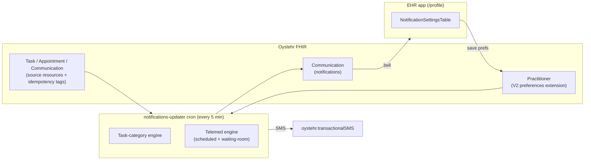
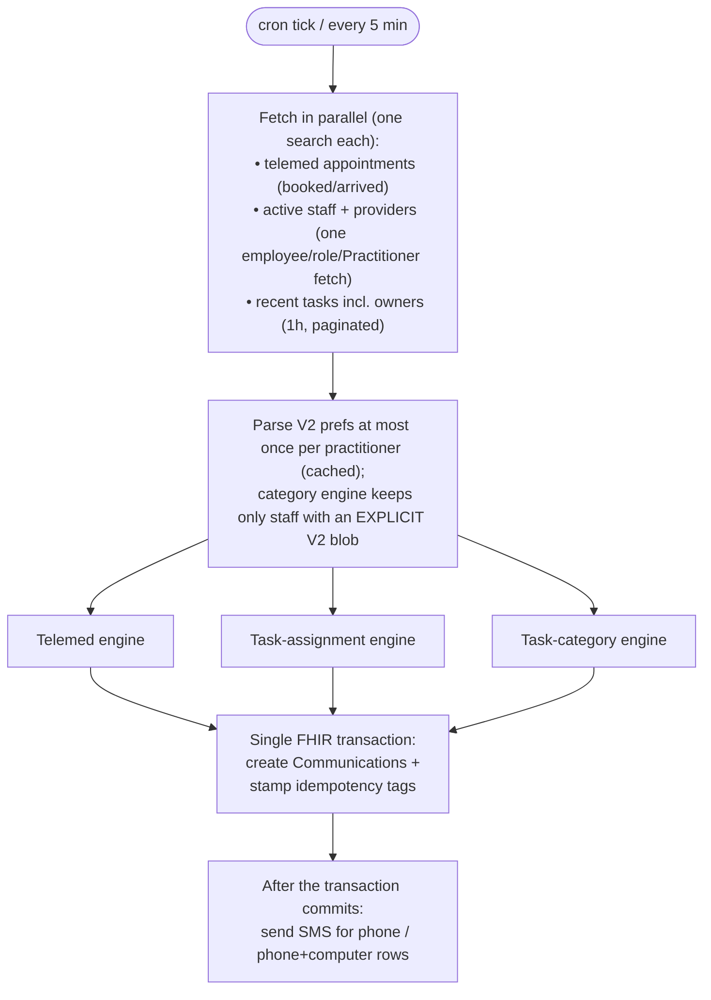
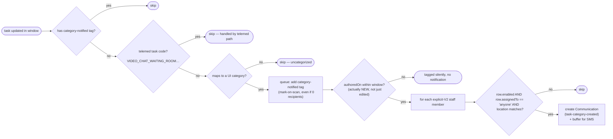
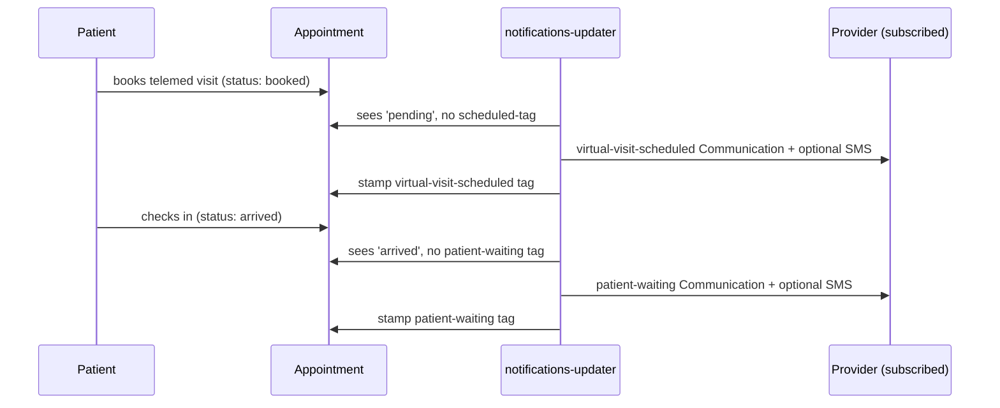
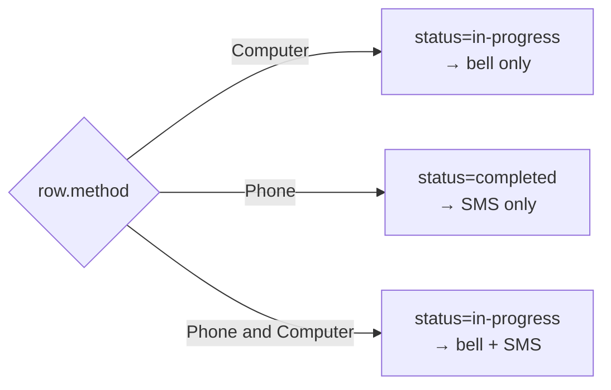

# Provider / Staff Notifications

This document describes the staff-notification system after the move to per-notification-type
registration, where each staff member subscribes to individual notification types (telemed events and
task categories) and, per type, chooses a delivery method, a set of locations, and an "assigned to"
filter.

It covers the data model, every notification flow, delivery semantics, backward compatibility, and edge
cases. Diagrams are Mermaid; ASCII fallbacks are included where useful.

---

## 1. Concepts at a glance

| Concept | Where | Meaning |
| --- | --- | --- |
| Preference (V2) | `Practitioner` extension (JSON) | A staff member's per-type notification settings. |
| Notification row | One entry in the settings table | `{ enabled, method, locationIds/allLocations, assignedTo }`. |
| Trigger | Backend cron | An event that may produce notifications (new task, booking, check-in). |
| Communication | FHIR resource | One delivered notification to one recipient (drives the in-app bell and/or SMS). |
| Idempotency tag | `meta.tag` on Task/Appointment/Communication | Marks a source resource "already processed" so the 5-minute cron never double-fires. |

Everything is produced by the `notifications-updater` cron (`packages/zambdas/src/cron/notifications-updater/index.ts`),
which runs every 5 minutes and looks back over a 1-hour window (the idempotency tags, not the window,
are the authoritative "already notified?" gate).



---

## 2. Data model

### 2.1 Storage (FHIR `Practitioner` extension)

Preferences are stored as a single JSON string inside a child of the existing settings-extension container
(same convention as `ScheduleExtension` / QuickPick config). Only the V2 blob is written on save. The legacy
flat values are no longer written; they may still exist on Practitioners saved before this feature and are read
only to migrate those staff (see [§6](#6-migration--backward-compatibility)).

```
Practitioner.extension[]
└─ url: https://fhir.ottehr.com/r4/provider-notifications-settings      (container)
   └─ url: .../r4/provider-notifications-preferences-v2      valueString  "<JSON.stringify(V2)>"  (source of truth)

   (read-only remnants on pre-feature Practitioners; never written anymore)
   ├─ url: .../r4/provider-notifications-method            valueString  (legacy)
   ├─ url: .../r4/provider-notifications-enabled-task       valueBoolean (legacy)
   └─ url: .../r4/provider-notifications-enabled-telemed    valueBoolean (legacy)

Practitioner.telecom[]  →  { system: 'sms', value: '+1XXXXXXXXXX' }   (phone number for SMS)
```

- Source of truth: the V2 JSON blob, and the only value written on save. The legacy children are read only to migrate pre-feature staff (see [§6](#6-migration--backward-compatibility)).
- Constants: `PROVIDER_NOTIFICATIONS_SETTINGS_EXTENSION_URL`, `PROVIDER_NOTIFICATION_PREFERENCES_V2_URL`,
  `PROVIDER_NOTIFICATION_METHOD_URL`, `PROVIDER_TASK_NOTIFICATIONS_ENABLED_URL`,
  `PROVIDER_TELEMED_NOTIFICATIONS_ENABLED_URL` (in `packages/utils/lib/types/api/`).

### 2.2 V2 preference shape

```ts
type NotificationAssignedTo = 'me' | 'anyone';

interface NotificationRowPref {
  enabled: boolean;
  method: ProviderNotificationMethod;   // 'Phone' | 'Computer' | 'Phone and Computer'
  locationIds: string[];                // explicit Location ids; ignored when allLocations = true
  allLocations: boolean;                // true = match any location
  assignedTo: NotificationAssignedTo;   // 'me' = only tasks assigned to this user; 'anyone' = all
}

interface ProviderNotificationPreferencesV2 {
  version: 2;
  virtualVisitScheduled: NotificationRowPref;             // "Patient schedules virtual visit"
  waitingRoom: NotificationRowPref;                       // "Patient is ready in the virtual waiting room"
  taskCategories: Record<UiTaskCategoryId, NotificationRowPref>;  // the task-category rows
}
```

Accessors (in `packages/utils/lib/fhir/patient.ts`):
- `getProviderNotificationPreferencesV2(practitioner)`, parses the blob; falls back to a derived-from-legacy
  default for un-migrated staff.
- `hasExplicitProviderNotificationPreferencesV2(practitioner)`, `true` only if the V2 blob is actually stored
  (used to decide who participates in the category engine).

### 2.3 Task categories

A FHIR `Task` carries its category code in `Task.groupIdentifier.value`. Several codes fold into one UI
category (auto-generated + manual variants). `getUiTaskCategoryForCode(code)` performs the fold.

| UI category (`UiTaskCategoryId`) | Label | Task `groupIdentifier.value` codes |
| --- | --- | --- |
| `externalLab` | External Lab | `external-lab`, `manual-external-lab` |
| `inHouseLab` | In-house Lab | `in-house-lab`, `manual-in-house-lab` |
| `radiology` | Radiology | `radiology`, `manual-radiology` |
| `erx` | eRX | `erx`, `manual-erx` |
| `inHouseMedications` | In-house Medications | `manual-in-house-medications` |
| `nursingOrders` | Nursing Orders | `manual-nursing-orders` |
| `patientFollowUp` | Patient Follow-up | `manual-patient-follow-up` |
| `procedures` | Procedures | `manual-procedures` |
| `charting` | Charting | `manual-charting` |
| `coding` | Coding | `manual-coding` |
| `billing` | Billing | `manual-billing` |
| `other` | Other | `manual-other` |

A task whose code is not in this map is uncategorized → the category engine skips it.

The category list is expected to grow: adding a category is a matter of extending `UI_TASK_CATEGORY_IDS`,
`UI_TASK_CATEGORY_LABELS`, and `TASK_CODE_TO_UI_CATEGORY`; the settings table and both cron engines then pick
it up with no further changes.

---

## 3. Notification type catalog

Each delivered notification is a FHIR `Communication` with a primary `category.coding` on system
`PROVIDER_NOTIFICATION_TYPE_SYSTEM` (`…/r4/provider-notifications-type`).

| Type code | Preference row | Trigger | Message | Links (`basedOn`/`encounter`) |
| --- | --- | --- | --- | --- |
| `task-category-created` | `taskCategories[id]` (`assignedTo: anyone`) | A new task (authored within the window) appears in a subscribed category | `New <Category> task: <description>` | `basedOn: Task/<id>` (+ secondary coding carrying the UI category) |
| `virtual-visit-scheduled` | `virtualVisitScheduled` | Telemed appointment reaches `booked` (`pending`) | `Virtual visit with <patient> at <time>` | `encounter: Encounter/<id>` |
| `patient-waiting` | `waitingRoom` | Telemed appointment reaches `arrived` | `<patient> is ready in the virtual waiting room` | `encounter: Encounter/<id>` |
| `task-assigned` | `taskCategories[id]` for migrated staff; legacy flags otherwise | A task is assigned to a user (owner set) | `A new task has been assigned to you: …` | `basedOn: Task/<id>` |

> `task-assigned` is emitted by the assignment engine ([§4.3](#43-task-assignment-engine)). For migrated staff it delivers all
> `assignedTo: 'me'` subscriptions, plus assignments of tasks whose creation round already passed (so an
> `'anyone'` subscriber still hears about a handoff); for un-migrated staff it keeps the legacy behavior.
> Telemed waiting-room tasks no longer flow through it at all, check-ins are handled by the appointment
> `arrived` path ([§4.2](#42-telemed-engine-scheduled--waiting-room-split)).

The in-app bell (`useGetProviderNotifications`) derives its category filter from
`AppointmentProviderNotificationTypes`, so every type above (and any future addition to the enum) is
fetched and displayed.

---

## 4. Backend flows

The cron fetches everything it needs once, then runs the engines. Un-migrated vs migrated staff are handled
differently (see [§6](#6-migration--backward-compatibility)).



### 4.1 Task-category engine (the core of per-type registration)

Fires for any newly-created task in a subscribed category, not only tasks assigned to the subscriber.
It delivers only `assignedTo: 'anyone'` rows: a team-wide "new task in this category" alert at creation
time. `'me'` rows (and later assignments) are delivered by the assignment engine ([§4.3](#43-task-assignment-engine)), so they aren't
lost when assignment happens after creation.



Matching predicate (`rowMatchesFilters` in the cron; the category engine calls it with
`isAssignedToMe = false` after pre-filtering to `'anyone'` rows, the assignment engine with `true`):

```
match(row, taskLocationId, isAssignedToMe) =
     row.enabled
  && (row.allLocations OR (taskLocationId != null AND row.locationIds includes taskLocationId))
  && (row.assignedTo == 'anyone' OR (row.assignedTo == 'me' AND isAssignedToMe))

taskLocationId = getTaskLocation(task)?.id   // from meta.tag system 'task-location'
```

- Audience: all active (non-Inactive) staff with a Practitioner profile, not just providers, so
  Billing/Coding/Charting reach non-provider staff. Access control is the subscription itself, not the role.
- Idempotency: a task is stamped with `category-notified` (system `CATEGORY_NOTIFICATION_TAG_SYSTEM`)
  the first time it's scanned and recognized, even if nobody was subscribed. This avoids re-scanning it on
  every subsequent 5-minute run.
- New-task gate: the search window uses `_lastUpdated` (indexed), which also re-surfaces old tasks the
  first time they're edited after this feature ships (they carry no tag yet). Those are tagged silently,
  `isTaskNewlyCreated` (authoredOn within the window) gates the actual notification, so a merely-edited
  months-old task never fires "New … task". A task with no `authoredOn` at all is treated as not-new.

### 4.2 Telemed engine (scheduled + waiting-room split)

The previous single "patient waiting" notification is split into two events on the same appointment
lifecycle. Each uses its own appointment `meta.tag` system so the two markers never overwrite each other.

```
appointment.status:   booked ───────────────▶ arrived
visit status:         'pending'               'arrived'
                         │                        │
                         ▼                        ▼
              virtual-visit-scheduled        patient-waiting (waiting room)
              tag: provider-virtual-         tag: provider-notifications-
                   visit-scheduled-tag            waiting-room-tag
              pref: virtualVisitScheduled    pref: waitingRoom
```

- Audience: active providers (`activeProvidersMap`), matched against each provider's
  `virtualVisitScheduled` / `waitingRoom` row (location + `assignedTo`, where `assignedTo='me'` means the
  provider is a participant on the encounter).
- Location guard: the booking path keeps the original `location.address.state` guard; the waiting-room
  path does NOT require a location state: the previous check-in delivery (the waiting-room Task fan-out) never
  had one, and a misconfigured Location must not silently swallow "your patient is waiting" (a task with no
  resolvable location then matches only `allLocations` rows).
- Deploy transition: older deploys stamped `provider-notifications-tag` / `'patient waiting'`
  on the appointment at booking time. The booking path treats that legacy tag as "already notified", so
  in-flight appointments don't get a duplicate booking notification; the waiting-room path uses its own
  fresh tag system, so those same appointments still get their check-in notification. (Patients already
  sitting in the waiting room at deploy time may receive one extra check-in notification, accepted
  one-time trade-off.)



### 4.3 Task-assignment engine

Fires for tasks with an owner whose assigned-date extension falls in the window, emitting `task-assigned`
Communications. Telemed waiting-room tasks are suppressed here entirely (the appointment `arrived`
path in [§4.2](#42-telemed-engine-scheduled--waiting-room-split) is the sole check-in emitter, this prevents double-notifying a single check-in).

The category engine runs first and records exactly which `(task, practitioner)` pairs it notified in
this run; the assignment engine (`resolveAssignmentDelivery`) defers only for those recorded pairs,
coordination by data, not by a mirrored predicate. Anyone the category engine skipped, for any reason
(including a task owner who is not part of its active-staff population, e.g. a deactivated practitioner
still owning a task), is still considered for delivery here.

```
for each recipient (the task owner) of an assigned task:
   if recipient has explicit V2 prefs AND the task maps to a UI category:
      row = prefs.taskCategories[category]
      skip if the category engine recorded (task, recipient) this run   (no double-notify on create-with-owner)
      notify if row matches (enabled + location), for BOTH:
         • 'me' rows       — the assignment engine is their only delivery path
         • 'anyone' rows   — for every case the category engine didn't just cover (assignment after
                             creation, old task, owner outside the category audience)
   else if recipient has explicit V2 prefs (uncategorized task):
      fall back to the legacy taskNotificationsEnabled flag  (no V2 row exists to consult)
   else (un-migrated staff):
      legacy behavior, gated on legacy taskNotificationsEnabled
```

---

## 5. Delivery semantics (in-app bell vs SMS)

`method` on each row drives both the `Communication.status` and whether an SMS is sent.

| Row `method` | `Communication.status` | In-app bell | SMS sent? |
| --- | --- | --- | --- |
| `Computer` | `in-progress` | ✅ shows (unread) | ❌ |
| `Phone` | `completed` | (not surfaced as unread) | ✅ (if `sms` telecom present) |
| `Phone and Computer` | `in-progress` | ✅ shows (unread) | ✅ (if `sms` telecom present) |

- `communicationStatusForMethod(method)` → `phone ⇒ 'completed'`, otherwise `'in-progress'`.
- SMS is buffered per-message with its own method (a staffer can be Phone for Billing but Computer for
  Charting). The send loop dispatches an SMS only when the message's method is `Phone` or `Phone and Computer`
  and the practitioner has an `sms` telecom value.



---

## 6. Migration & backward compatibility

Two populations coexist. The distinguishing factor is whether an explicit V2 blob is stored
(`hasExplicitProviderNotificationPreferencesV2`).

| Behavior | Un-migrated staff (no V2 blob) | Migrated staff (explicit V2 blob) |
| --- | --- | --- |
| Task notifications | Legacy `task-assigned` only, tasks assigned to them, gated on legacy `taskNotificationsEnabled`. Category engine ignores them. | `task-category-created` at creation for `'anyone'` rows; `task-assigned` from the assignment engine for `'me'` rows and for later assignments ([§4.3](#43-task-assignment-engine)). The two engines coordinate so one event never notifies the same person twice. |
| Telemed | Both `virtual-visit-scheduled` (booking) and `patient-waiting` (check-in), derived from legacy `telemedNotificationsEnabled`, all locations, anyone. | Per their explicit `virtualVisitScheduled` / `waitingRoom` rows. |
| Legacy readers | Read the legacy flat values, or the derived-from-legacy fallback via `getProviderNotificationPreferencesV2`. | All in-app readers (`gettingAlerts`, the bell's phone-only check) read the V2 blob via `getProviderNotificationPreferencesV2`. Legacy flat values are neither written nor maintained. |

> Note (intentional change): un-migrated telemed users now receive two events (scheduled + waiting-room)
> where the old code sent one at booking. Same audience, treated as an enhancement. Saving the settings page
> once migrates a user (writes the V2 blob) and puts them fully on the new engine.

On save (`useUpdateProviderNotificationPreferencesV2Mutation`): only the V2 blob is written, plus the `sms`
telecom. No legacy flat values are written.

On read for un-migrated staff (`getProviderNotificationPreferencesV2`): when no V2 blob exists, a full V2
object is derived from whatever legacy flat values are present, so un-migrated staff keep working until their
first save migrates them:

```
taskCategories[*]        = enabled from legacy taskNotificationsEnabled (all-locations, anyone)
virtualVisitScheduled    = enabled from legacy telemedNotificationsEnabled (all-locations, anyone)
waitingRoom              = enabled from legacy telemedNotificationsEnabled (all-locations, anyone)
```

---

## 7. Idempotency tags (critical)

`getPatchOperationForNewMetaTag` matches a tag by system only and replaces any existing tag with that
system. Therefore every notification path uses a distinct system URL, so markers coexist on one resource
instead of clobbering each other.

| Marker | Resource | System | Code |
| --- | --- | --- | --- |
| Category notified | Task | `…/r4/provider-notifications-category-tag` | `category-notified` |
| Task assigned | Task | `…/r4/provider-notifications-tag` | `task-assigned` |
| Virtual visit scheduled | Appointment | `…/r4/provider-notifications-virtual-visit-scheduled-tag` | `virtual-visit-scheduled-notified` |
| Patient waiting (waiting room) | Appointment | `…/r4/provider-notifications-waiting-room-tag` | `waiting-room-notified` |
| (legacy, read-only) booking notified by an older deploy | Appointment | `…/r4/provider-notifications-tag` | `patient waiting` |

The legacy row is never written anymore; the booking path only reads it to avoid re-notifying
appointments the old cron already handled ([§4.2](#42-telemed-engine-scheduled--waiting-room-split), deploy transition).

All notification URLs/systems (including the secondary category coding
`…/r4/provider-notifications-category`) share the `…/r4/provider-notifications-*` family prefix.

A single Task may legitimately carry both `task-assigned` and `category-notified`, the tags are
queued per task and flushed as one patch of per-tag append operations (deliberately not a wholesale
`/meta/tag` replace, which would clobber tags a concurrent writer added between the cron's read and its
transaction); an Appointment may carry both the scheduled and the waiting-room markers.

All Communications and tag patches are written in one FHIR transaction, so a failure never leaves a
resource marked-but-not-notified (or vice versa). SMS messages are dispatched only after that
transaction commits, a failed transaction therefore re-notifies on the next run without ever having
double-texted anyone (an SMS send failure after the commit is logged, not retried).

---

## 8. Edge cases & expected behavior

| Situation | Expected behavior |
| --- | --- |
| Task has no location | Matches only rows with `allLocations = true`. Rows with an explicit location list do not match. (Recommend defaulting Charting/Coding/Billing to all-locations.) |
| Row has `allLocations = false` and empty `locationIds` | Repaired on read: `normalizeNotificationPreferencesV2` coerces an empty location list to `allLocations = true`, since an enabled row that matches nothing would silently deliver nothing. The UI also prevents creating this state (deselecting the last location falls back to "All locations"). |
| `assignedTo = 'me'` but task has no owner | No match for that subscriber; only `anyone` subscribers are notified. |
| Task edited repeatedly | `_lastUpdated` re-surfaces it, but the `category-notified` tag short-circuits → fires once. |
| Old task (created before the feature / outside the window) edited for the first time | Enters the window untagged, but `isTaskNewlyCreated` fails → tagged silently, no "New task" notification. |
| Task without `authoredOn` | Never treated as newly created → no creation notification (tagged silently); an assignment still notifies via the assignment engine. |
| Task assigned after creation | The creation round is over (task already tagged), so the assignment engine notifies the new owner, for `'me'` rows and `'anyone'` rows ([§4.3](#43-task-assignment-engine)). Reassignments after the first `task-assigned` tag do not re-fire (pre-existing single-shot behavior). |
| Uncategorized task (unknown `groupIdentifier.value`) | Skipped by the category engine; assignments fall back to the legacy `taskNotificationsEnabled` flag. |
| Telemed waiting-room task (`VIDEO_CHAT_WAITING_ROOM…`) | Excluded from both task engines; check-ins are delivered solely by the appointment `arrived` path ([§4.2](#42-telemed-engine-scheduled--waiting-room-split)). Known trade-off: delivery is therefore gated on the appointment actually reaching `arrived`, if a waiting-room Task were created while the appointment status patch failed/lagged, no notification fires until the status catches up (the old task fan-out fired regardless of appointment status). Accepted: check-in sets the status in the same flow, and a visit whose status never updates is broken more broadly than notifications. |
| Telemed Location missing `address.state` | Booking notification is skipped (original guard); the waiting-room notification still fires (no state requirement, see [§4.2](#42-telemed-engine-scheduled--waiting-room-split)). |
| Category enabled after a task was created | The task is already tagged `category-notified` (mark-on-scan) → the late subscriber won't get a retroactive creation notification. Trade-off chosen for performance. (They are still notified if the task is later assigned to them.) |
| No `sms` telecom on the practitioner | SMS is skipped even for Phone/Phone+Computer rows; in-app still works for Computer/both. |
| Large burst of tasks × many staff | Task and Practitioner searches paginate (`getAllFhirSearchPages`); consider chunking the FHIR transaction (`chunkThings`) if volumes grow. SMS sends run in parallel after the transaction. Volume is bounded by new tasks per hour. |

---

## 9. Reference, key files

| Area | File |
| --- | --- |
| V2 types, maps, tag/URL constants, helpers | `packages/utils/lib/types/api/provider-notifications.ts` |
| Notification-type enum (`AppointmentProviderNotificationTypes`) | `packages/utils/lib/types/api/practitioner.types.ts` |
| `getProviderNotificationPreferencesV2`, `hasExplicit…` | `packages/utils/lib/fhir/patient.ts` |
| Cron engines (task-category, telemed, assignment) | `packages/zambdas/src/cron/notifications-updater/index.ts` |
| Task location/category helpers | `packages/zambdas/src/shared/tasks.ts` |
| Settings UI table | `apps/ehr/src/features/notifications/NotificationSettingsTable.tsx` |
| Settings page (`/profile`) | `apps/ehr/src/pages/EmployeeProfilePage.tsx` |
| Read/write queries + locations hook | `apps/ehr/src/features/notifications/notifications.queries.ts` |
| In-app bell | `apps/ehr/src/features/notifications/ProviderNotifications.tsx` |
| Unit tests | `packages/utils/lib/fhir/patient.providerNotificationsV2.test.ts`, `packages/zambdas/test/unit/notifications-updater.test.ts` |
