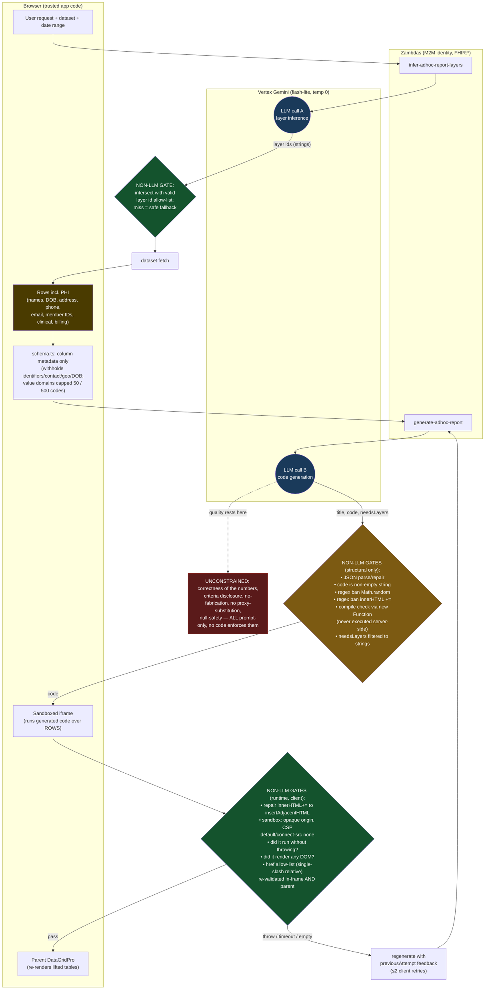

# Ad-Hoc AI Reporting — Technical Design & Review Concerns

**PR:** #8320 · `dabrams/otr-2733-ai-assisted-ad-hoc-reporting` · **Ticket:** OTR-2733
Scope: ~49 files across `packages/zambdas`, `apps/ehr`, `packages/utils`, one `config/oystehr-core` entry.

---

## 1. Architecture overview

The feature is a frontend page plus eight new zambdas. The design's defining choice is a
**strict trust boundary between data and model**: the LLM receives only *column metadata*, never
rows; the model's *output* is untrusted code that runs in a locked-down sandbox over the real
rows client-side.

**Backend zambdas** (all `http_auth`, `nodejs22.x`):

- `adhoc-encounters`, `adhoc-patients`, `adhoc-billing` — fetch a dataset (FHIR → flat rows).
- `infer-adhoc-report-layers` — **LLM**: pick which opt-in layers a request needs.
- `generate-adhoc-report` — **LLM**: turn schema + request into report JavaScript.
- `save-adhoc-report`, `list-adhoc-reports`, `delete-adhoc-report` — persist saved reports as
  FHIR `Basic` resources.

**Frontend** (`apps/ehr/src/features/reports/adHoc/` + `pages/reports/AdHocReport.tsx`):

- Dataset modules build the request and, from the returned rows, compute the **schema**
  (`schema.ts`) — column metadata only.
- `AdHocReport.tsx` orchestrates: infer layers → fetch → generate → render → refine/save.
- `ReportFrame.tsx` hosts the **sandboxed iframe** that executes the generated code.
- `AdHocTableGrid.tsx` re-renders any table the report drew as an MUI `DataGridPro`.

**End-to-end data flow** (fresh report):

```
User request + dataset + date range
   │
   ├─(A)─▶ infer-adhoc-report-layers   [LLM] ─▶ layer ids  ──┐
   │                                                          ▼
   ├─────▶ adhoc-{encounters|patients|billing}  ── FHIR (M2M) ─▶ rows (PHI)  ─▶ browser memory
   │                                                          │
   │                                    schema.ts builds column metadata from rows
   │                                                          ▼
   ├─(B)─▶ generate-adhoc-report(schema, request)  [LLM] ─▶ report code (untrusted JS)
   │                                                          ▼
   └─────▶ ReportFrame: sandboxed iframe runs code over rows ─▶ charts/KPI in frame
                                                              └▶ tables lifted to parent DataGrid
```

Only **(A)** and **(B)** are LLM calls. Rows never enter either call; they flow only
browser → iframe.

---

## 2. Where the LLM calls are, and what constrains their output

There are exactly **two LLM call sites in the live path** (a third, `invokeClaudeStructured`
for Anthropic, is present but dormant — `REPORT_MODEL` is wired to the default Vertex model;
the last commit explicitly keeps it "for Sonnet toggle-back"). Both live calls go to **Vertex
AI Gemini** (`gemini-3.1-flash-lite`, `temperature: 0`, `responseSchema` JSON) via
`invokeChatbotVertexAI` (`packages/zambdas/src/shared/ai.ts`).

> Note: `generate-adhoc-report` *intends* a stronger model — there's a `REPORT_MODEL` seam and a
> comment to bump it — but it currently resolves to the same flash-lite default. So report code
> is generated by the small/cheap model today.

### LLM-call & constraint diagram



### Constraint summary

| LLM output | Non-LLM code that **constrains** it | What is **NOT** constrained |
|---|---|---|
| **A. layer ids** | Filtered to the dataset's real layer ids (`validIds.has(id)`), de-duped; any failure → empty set and the report proceeds. **Strong** — a hallucinated id simply can't take effect. | Whether the *right* layers were chosen (a miss just means a follow-up fetch or a "loading…" note). Low stakes. |
| **B. report code** (server) | `fixAndParseJsonObjectFromString`; non-empty `code` string; **regex** ban on `Math.random` and `innerHTML +=`; **compile-only** parse via `new Function` (discarded, never run); `needsLayers` filtered to strings. | **Everything semantic.** Nothing checks that the code computes the right metric, filters on the right codes, discloses its criteria, avoids fabricating or proxy-substituting a field, or handles nulls. These are ~40 prompt rules with **no code enforcement**. |
| **B. report code** (client runtime) | `repairGeneratedReportCode` heals `innerHTML +=`; the sandbox renders it; **render outcome** is the validation — threw / timed out (8 s) / rendered-nothing all count as failure and trigger regeneration with the failing code + error fed back (`previousAttempt`), up to 2 client retries. | Still only *"did it run and draw something,"* never *"is it right."* A confidently-wrong report renders successfully and passes every gate. |
| **B. generated hrefs** | `isInternalHref` allow-list (single-slash relative only; tab/newline stripped first) enforced **twice** — inside the frame before relaying, and in the parent before `window.open`. **Strong.** | — |
| **B. generated tables** | Serialized to structured `{columns, rows, href, bg}` and re-rendered by trusted React; the parent never `eval`s or `innerHTML`s frame markup. **Strong.** | — |

The `Math.random` / `innerHTML +=` regex bans are **quality** guards, not security boundaries —
trivially evadable (`Math['ran'+'dom']`), which is fine because the model isn't adversarial, but
they should not be read as containment.

---

## 3. The iframe boundary — does *all* the visualization run in the frame?

**No. The visualization UI is split across two execution contexts**, and this is deliberate:

- **Inside the sandboxed iframe:** the model's code executes and renders **charts (Chart.js),
  KPI numbers, and any free-form DOM**. Chart.js is inlined into the frame from source (`?raw`),
  so the frame needs no network.
- **Outside the frame, in the trusted parent app:** **every `<table>` the report draws is
  extracted, hidden inside the frame, serialized, and posted to the parent**, which re-renders it
  as a native `DataGridPro` (`AdHocTableGrid.tsx`) — that's where sort/filter/CSV-export/
  drill-down come from. For a **pure-table report the iframe is collapsed** (`display:none`)
  entirely and the user sees only parent-rendered grids.
- **Drill-down round-trips both boundaries:** a row click in the parent grid → `postMessage`
  into the frame → the report's `window.reportRowClick` handler runs *in the frame* → renders a
  detail table → a `MutationObserver` lifts it back out to a parent grid.

So untrusted code runs **only** in the frame, but the **rendered output and the underlying data
straddle the boundary**: the PHI rows are posted *into* the frame, and table cell text (which can
contain PHI) is posted *back out* to the parent and rendered there by trusted code.

**Sandbox controls** (`ReportFrame.tsx`), and what each defends:

| Control | Defends against |
|---|---|
| `sandbox="allow-scripts"` **without** `allow-same-origin` | Frame runs at an **opaque origin** — no access to app DOM, cookies, `localStorage`, or the auth token. |
| CSP `default-src 'none'`, `connect-src 'none'` | No `fetch`/XHR/WebSocket/beacon/EventSource — **no data exfiltration by network**. |
| CSP `img-src data: blob:` (no external) | No pixel-exfil via ``. |
| `window.open` overridden to `return null`; no `allow-popups` | Frame can't open windows to carry data out. |
| Anchor-click egress guard + `isInternalHref` (in frame **and** parent) | Only single-slash relative app links navigate; absolute/`//`/`javascript:`/`/\evil` dropped. |
| **Single-load backstop** (`handleLoad`) | Any *second* load event = the frame navigated itself (the one channel CSP can't stop) → frame is blanked and the render fails safe. |
| 8 s render timeout | A hung/`while(true)` report is contained and reported as a failure. |

**Residuals worth noting:** the CSP is delivered via `<meta http-equiv>` (not an HTTP header);
`script-src` must include `'unsafe-inline'` **and** `'unsafe-eval'` because the whole mechanism
is `new Function(modelCode)`. These are inherent to "run model-written JS in the browser" and are
reasonably contained by the opaque origin + `connect-src 'none'`, but they mean the frame's
safety rests entirely on the sandbox/CSP being correct — there is no second layer if a bypass is
found. Server-side execution of model code was **removed** on purpose (it was an RCE surface);
the server now only *compiles* (never runs) the code. That's the right call.

---

## 4. Reliability analysis

**The hard guarantees are structural and runtime, not semantic.** Non-LLM code guarantees a
generated report (1) is syntactically valid JS, (2) can't use the network, (3) runs without
throwing, and (4) draws *something*. It guarantees **nothing** about whether the report is
*correct*. All of the anti-fabrication, criteria-disclosure, no-proxy-substitution, and
null-safety protections are **prompt instructions with no code backing** (see the constraint
table). For a clinical/billing tool, "it rendered" and "it's right" are very different bars, and
only the first is enforced.

**Determinism.** `temperature: 0` reduces but does not guarantee determinism on Gemini, so two
generations of the same request can differ. Saved reports mitigate this by **freezing the code**
and re-running it over fresh data — good — but that same frozen code is **never re-validated for
correctness**, so a report that was subtly wrong on day one stays wrong on every open.

**Auto-repair persistence.** When a *saved* report's stored code crashes on today's data, the
client regenerates it and, on a successful render, **silently writes the new (unreviewed) code
back over the saved report** (`handleRendered` → `saveAdHocReport`). A curated tile can thus be
quietly replaced by fresh model output without anyone's involvement.

**Retry budget.** Generation retries live in two layers: server `MAX_ATTEMPTS = 2` (covers only
transport/parse/compile faults) and client `MAX_AUTO_RETRIES = 2` (covers render failures, with
error feedback). A single user click can therefore cost up to ~6 model generations plus repeated
dataset fetches.

---

## 5. Biggest concerns (ranked)

### 🔴 1. Server-side authorization is far wider than the UI implies (broken access control)
The UI gates `/reports/ad-hoc` and the saved-report tiles to **`RoleType.Administrator`**
(`App.tsx:220`, `Reports.tsx`), but that's a **client-side check only**. On the backend:
- All eight zambdas are declared `http_auth` with **no per-zambda role/policy** in
  `zambdas.json`.
- `roles.json` grants the wildcard **`Zambda:Function:*`** to **Administrator, Customer Support,
  Manager, Staff, and Provider**. So any of those roles can invoke `adhoc-encounters`,
  `adhoc-patients`, `adhoc-billing`, and the save/list/delete endpoints **directly**.
- The handlers do **no in-handler role check** and run FHIR under the **`ZAMBDAS_ADMIN` M2M,
  which holds `FHIR:*` on `FHIR:*`** (`m2ms.json`). The caller's own FHIR scope is never used —
  it only gates *invocation*.

**Net effect:** a Staff or Provider user (front desk, any clinician) who calls the zambda
directly — bypassing the menu they can't even see — receives **full-practice cross-patient PHI
and complete billing/insurance data** (names, DOB, address, phone, email, member IDs, coverage,
claims). This is a genuine privilege-escalation / IDOR-class gap, and it's higher-impact here
than for the existing canned reports because these endpoints return arbitrary, comprehensive
datasets. **This pattern (client-only RBAC + wildcard zambda + `FHIR:*` M2M) predates this PR,
but this feature materially widens the blast radius.** *Must-fix:* enforce the intended role in
each handler (or via an access policy), and confirm the M2M-vs-caller-scope decision is
intentional.

### 🟠 2. No correctness guarantee on clinical/financial numbers
Covered in §4. The only validation is "it ran and drew something." A wrong denominator, an ICD
prefix that misses subtypes, a silently-substituted proxy field, or a miscount renders exactly
like a correct report. There is no criteria-disclosure enforcement, no verification pass, no
"show me what was counted," and no audit trail of the generated code's logic. For an EHR this is
the second-most-serious issue after access control. *Recommend:* visible AI-generated labeling +
mandatory on-report disclosure of selection criteria, and consider a "verified report" tier.

### 🟠 3. PHI blast radius + unbounded fetch/perf
- **No date-range cap and no row cap** anywhere; `validateRequestParameters` only type-checks
  that `dateRange.start/end` are strings.
- The client splits ranges into 7-day windows and fetches **all windows concurrently with no
  concurrency limit** — a 1-year report ≈ 52 simultaneous zambda executions.
- `fetchAllPages` **silently truncates at offset > 100,000** (only a `console.warn`) — large
  practices can drop data with no user-visible signal.
- Billing layers do **full-table scans** (`Claim`, `ClaimResponse`, `ChargeItemDefinition`
  fetched in their entirety) **on every 7-day batch** — the code even documents having moved
  *other* resources off this pattern for exactly this reason.
- Every fetched row (full PHI) is held in browser memory and posted into the iframe.

### 🟡 4. Auto-persist overwrites saved report code
A saved (possibly human-reviewed) tile's code can be silently replaced by fresh model output on
open (§4). At minimum this should be visible/opt-in, and saved reports should be versioned.

### 🟡 5. Prompt-injection surface via data-derived value domains
The schema sent to the model includes **value domains computed from real data** for operational
categoricals (e.g. `source`/point-of-discovery, `serviceCategory`, provider and location names,
ICD/CPT code sets). If any of those values is attacker-influenced free text, it reaches the
generate prompt. Severity is **low** — the output runs in the locked sandbox and can't phone
home — but it's worth a conscious call on whether `source`/provider/location domains belong in
the prompt. (Names/DOB/contact/geo and flagged free-text clinical fields are correctly withheld,
with a regression test.)

### 🟡 6. Cost / DoS amplification
One click can trigger layer-inference + up to ~6 code generations + many dataset fetches (§4),
all on the strong-model seam if it's ever enabled. No rate limiting or per-user budget is
apparent.

### ⚪ 7. Correctness/robustness nits
- **Non-deterministic billing price:** `cptPriceMap` is first-write-wins across charge masters,
  so `expectedCharge` depends on fetch order when two masters price a CPT differently.
- **Stale warm-container cache:** `staffNameByEmail` is process-cached and never invalidated;
  registrar-name changes are stale until a cold start (acknowledged in comments).
- **Follow-up rows can fall outside the requested date range** (they carry their own later
  dates), which is easy to trip over in aggregation.
- The generate model is currently the **flash-lite** default despite the "use a stronger model
  for code gen" intent — worth confirming that's deliberate for launch.

---

## 6. What's done well (for balance)

- **The data/model trust boundary is the right architecture:** rows never reach the LLM; only
  capped, identifier-scrubbed column metadata does, with a **regression test** pinning the
  privacy invariant.
- **The sandbox is genuinely thoughtfully built** — opaque origin, `connect-src 'none'`,
  neutered `window.open`, dual-validated relative-only links, and a single-load egress backstop
  for the one channel CSP can't cover.
- **Removing server-side execution of model code** (the old `vm`/child-process validator) closed
  an RCE surface; compile-only checking is the correct residue.
- **Structured `APIError`s** in validation (no raw `throw new Error` that would page on-call),
  **256 KB** cap on saved definitions, id-scoped existence checks before update/delete, graceful
  partial-failure degradation on layer fetches, and shared dedup helpers are all solid.

---

## 7. Recommended must-fix before merge

1. **Enforce the admin restriction server-side** (in-handler role check or access policy), and
   consciously decide whether these endpoints should run under the caller's FHIR scope rather
   than the `FHIR:*` M2M. *(Concern #1.)*
2. **Bound the query:** a maximum date range and/or row cap, a concurrency limit on the windowed
   fan-out, and a **user-visible signal** when results are truncated (100k) or partial. *(#3.)*
3. **Make AI-generated status and selection criteria visible on every report**, and treat
   correctness as unverified in the UI copy. *(#2.)*
4. **Make saved-report auto-repair visible/opt-in and version saved definitions.** *(#4.)*
5. Confirm the intended **generation model** (flash-lite vs. the stronger seam) and add basic
   **rate/budget limiting** on generation. *(#6, #7.)*
