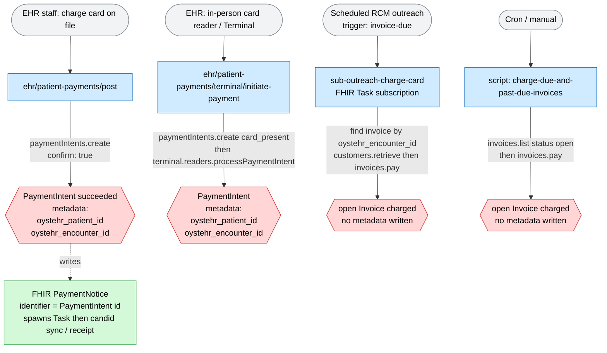
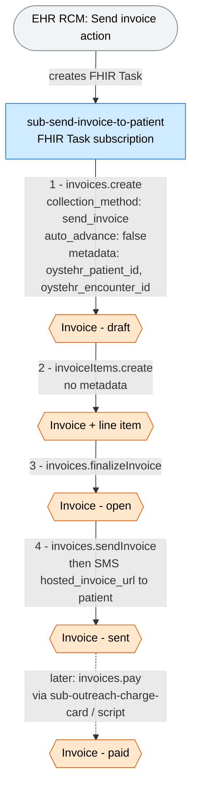
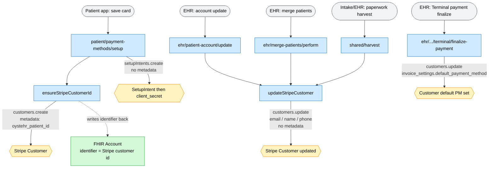
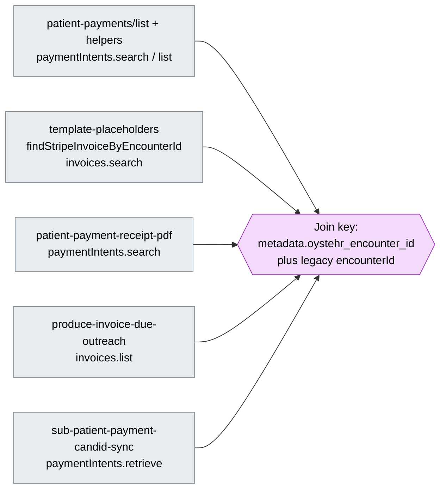

# Stripe Integration Map (zambdas)

A map of every place the zambda backend invokes the Stripe API, with the metadata
written on each object. Focused on **charges** and **invoices**.

All calls go through `getStripeClient(secrets)` (`shared/stripeIntegration.ts` and
`patient/payment-methods/helpers.ts`), pinned to Stripe API version `2024-04-10`.
Almost every call passes a `stripeAccount` option — Ottehr uses **Stripe Connect
connected accounts**, resolved per appointment/encounter.

**Metadata convention** on money/billing objects:

```
metadata: { oystehr_patient_id, oystehr_encounter_id }
```

Two exceptions to keep in mind: **Customers** carry only `oystehr_patient_id`, and
**legacy PaymentIntents** used a singular `encounterId` key (see "Gotchas").

---

## 1. Charges — money actually moves

Charges happen two ways: a confirmed `PaymentIntent`, or paying an open `Invoice`.



| # | Location | Stripe call | Metadata set | Trigger |
|---|----------|-------------|--------------|---------|
| 1 | `ehr/patient-payments/post/index.ts:141` | `paymentIntents.create` with `confirm: true` | `oystehr_encounter_id`, `oystehr_patient_id` | EHR staff charges a card on file |
| 2 | `ehr/patient-payments/terminal/initiate-payment/index.ts:70` | `paymentIntents.create` (`card_present`, `capture_method: automatic`, `setup_future_usage: off_session`) then `terminal.readers.processPaymentIntent` | `oystehr_patient_id`, `oystehr_encounter_id` | EHR in-person Stripe Terminal |
| 3 | `subscriptions/task/sub-outreach-charge-card/index.ts:251` | `invoices.pay` (after `customers.retrieve` to verify default PM) | none — invoice looked up by `oystehr_encounter_id` | Scheduled RCM outreach, via FHIR Task |
| 4 | `scripts/charge-due-and-past-due-invoices.ts:192` | `invoices.pay` | none — reads `customer.metadata.oystehr_patient_id` | Manual / cron **script** (not a deployed zambda) |

---

## 2. Invoices — created, finalized, sent, (later) paid

The whole invoice-creation lifecycle lives in **one** subscription task, fired by a
FHIR Task that the EHR's RCM "Invoicing" UI creates.



| Step | Location | Stripe call | Metadata |
|------|----------|-------------|----------|
| 1 | `subscriptions/task/sub-send-invoice-to-patient/index.ts:203` | `invoices.create` (`collection_method: send_invoice`, `auto_advance: false`, `pending_invoice_items_behavior: exclude`, `due_date`) | `oystehr_patient_id`, `oystehr_encounter_id` |
| 2 | `…/sub-send-invoice-to-patient/index.ts:166` | `invoiceItems.create` | **none** |
| 3 | `…/sub-send-invoice-to-patient/index.ts:96` | `invoices.finalizeInvoice` | — |
| 4 | `…/sub-send-invoice-to-patient/index.ts:102` | `invoices.sendInvoice` (then SMS the `hosted_invoice_url`) | — |

Other invoice **send** points are scripts (not zambdas):
`scripts/send-past-due-invoices-to-patients-by-sms.ts` calls `invoices.sendInvoice`
at `:534`, `:630`, `:730`.

---

## 3. Customers & SetupIntents — no charge



| Location | Stripe call | Metadata |
|----------|-------------|----------|
| `shared/stripeIntegration.ts:83` (`ensureStripeCustomerId`) | `customers.create` | `oystehr_patient_id` — then writes customer id onto FHIR `Account.identifier` |
| `ehr/shared/harvest/index.ts:4235` (`updateStripeCustomer`) | `customers.update` (email/name/phone) | none |
| `ehr/patient-account/update/index.ts:158` | calls `updateStripeCustomer` | none |
| `ehr/merge-patients/perform.ts:297` | calls `updateStripeCustomer` | none |
| `ehr/patient-payments/terminal/finalize-payment/index.ts:222` | `customers.update` (set `default_payment_method`) + `paymentMethods.detach`/`retrieve`/`list`, `paymentIntents.retrieve` | none |
| `patient/payment-methods/setup/index.ts:72` | `setupIntents.create` (after `ensureStripeCustomerId`) | none on the intent |
| `patient/payment-methods/{list,set-default,delete}` | `customers.retrieve`/`listPaymentMethods`/`update`, `paymentMethods.retrieve`/`detach` | none |

---

## 4. Terminal / reader & account config — no charge

- `ehr/patient-payments/terminal/check-payment-status/index.ts:42` — `terminal.readers.retrieve`
- `ehr/patient-payments/terminal/cancel-reader-action/index.ts:39` — `terminal.readers.cancelAction`
- `ehr/patient-payments/terminal/get-config/index.ts:60` / `:66` — `terminal.readers.list`
- `rcm/payments/get-terminal-readers/index.ts:28` — `terminal.readers.list`
- `rcm/payments/get-stripe-account-info/index.ts:46` / `:65` — `accounts.retrieve`, `terminal.locations.list`

---

## 5. Read-only lookups — join back to FHIR by metadata

These set no metadata but **query by it**, so they are the linkage arrows in reverse.



- `ehr/patient-payments/list/index.ts` + `helpers.ts:58` / `:144` — `paymentIntents.search` with query `metadata['encounterId']:"…" OR metadata['oystehr_encounter_id']:"…"` (the legacy-key fallback), plus `paymentIntents.list/retrieve`, `paymentMethods.list/retrieve`
- `shared/template-placeholders.ts:160` (`findStripeInvoiceByEncounterId`) — `invoices.search` on `metadata['oystehr_encounter_id']`
- `shared/pdf/patient-payment-receipt-pdf.ts:176` / `:183` / `:278` — `paymentIntents.search`, `customers.retrieve`, `paymentMethods.retrieve`
- `rcm/scheduled-outreach/producers/shared/produce-invoice-due-outreach.ts:118` — `invoices.list`, then reads `invoice.metadata.oystehr_patient_id` / `oystehr_encounter_id`
- `subscriptions/task/sub-patient-payment-candid-sync-and-receipt/index.ts:126` — `paymentIntents.retrieve`
- Read-only scripts: `report-past-due-invoices.ts`, `send-invoices-to-patients-by-sms.ts`, `send-past-due-invoices-to-patients-by-sms.ts`

---

## Metadata reference

| Stripe object | Created in | Metadata keys |
|---------------|-----------|---------------|
| PaymentIntent (card on file) | `ehr/patient-payments/post` | `oystehr_encounter_id`, `oystehr_patient_id` |
| PaymentIntent (terminal) | `ehr/.../terminal/initiate-payment` | `oystehr_patient_id`, `oystehr_encounter_id` |
| Invoice | `sub-send-invoice-to-patient` | `oystehr_patient_id`, `oystehr_encounter_id` |
| InvoiceItem | `sub-send-invoice-to-patient` | *(none)* |
| Customer | `ensureStripeCustomerId` | `oystehr_patient_id` only |
| Customer (update) | `updateStripeCustomer`, `finalize-payment` | *(none — metadata untouched)* |
| SetupIntent | `patient/payment-methods/setup` | *(none)* |

## FHIR ↔ Stripe linkage (join keys)

- **Stripe Customer** ↔ FHIR `Account.identifier`
  (systems `ACCOUNT_PAYMENT_PROVIDER_ID_SYSTEM_STRIPE` / `…_STRIPE_ACCOUNT` for
  connected accounts) — `makeStripeCustomerId`, `patient/payment-methods/helpers.ts:95`
- **Stripe PaymentIntent** ↔ FHIR `PaymentNotice.identifier`
  (system `https://fhir.oystehr.com/PaymentIdSystem/stripe`, `stripeIntegration.ts:51`)
- **Stripe Invoice / PaymentIntent → Patient / Encounter** — only via the
  `oystehr_patient_id` / `oystehr_encounter_id` metadata

## Gotchas

1. **Legacy `encounterId` key** — older PaymentIntents stored the encounter under
   `encounterId` (singular), not `oystehr_encounter_id`. Only the payment-list query
   handles both; invoice lookups (`findStripeInvoiceByEncounterId`) and outreach match
   `oystehr_encounter_id` only.
2. **Not Stripe (don't confuse it)** — `subscriptions/task/sub-send-patient-statement-by-mail/index.ts:130`
   sets `metadata: { oystehr_patient_id, oystehr_encounter_id, oystehr_project_id }` on a
   **physical-mail** API (`mailingClass`/`color`/`doubleSided`), not Stripe.
```